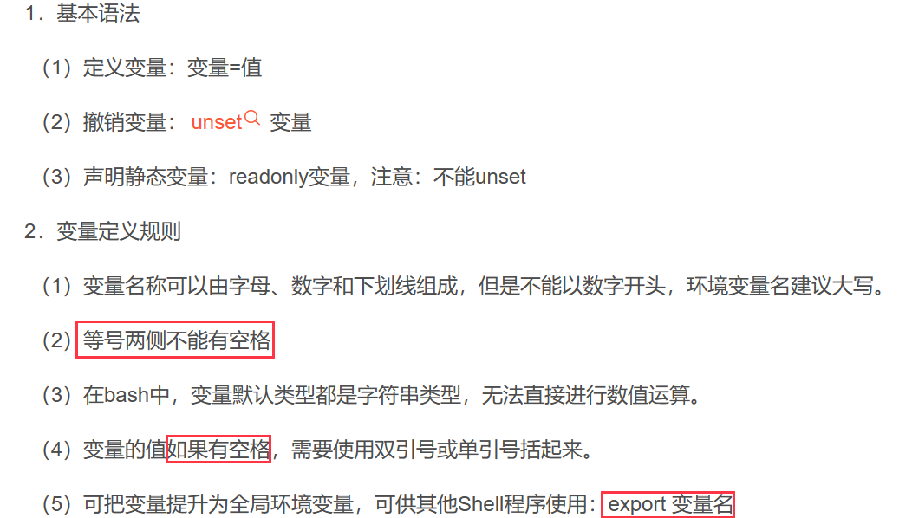
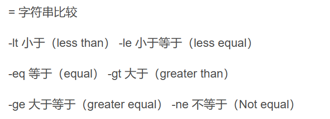
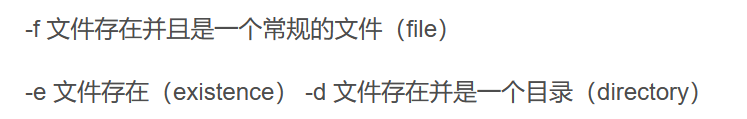
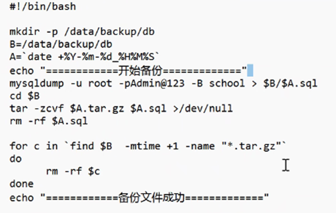

# 一、shell的基本命令

## 1、基本知识

### 1、多命令处理

`touch demo.txt`

`echo "i like" >> demo.txt`

### 2、$n命令

`$n (第几个参数)`

`$*/@(命令行中所有的参数)(整体/区分)`

`$# (所有参数的个数)`

`$? (最后一次执行的命令的返回状态)（0为正确）`

### 3、括号的使用

((...)) or [...]（与运算符之间要有空格）

`S=$[(3 + 2) * 4]`

### 4、变量定义规则

## 2、条件判断

### 1、基本

[ condition ] (condition前后要有空格)

*条件非空为true，[]返回false。

### 2、常用判断条件

1、两个整数之间比较

 2、按照文件权限进行判断

3、按照文件类型进行判断

4、多条件判断

&& 与（只有真才继续判断） ；|| 或 （不真也继续向下判断）

### 3、流程控制

~~~shell
if [ 条件判断式 ];then
程序
fi
~~~

~~~shell
if [ 条件判断式 ]
then
程序
fi
~~~

* 中括号和条件判断式之间必须有空格
* if后面要有空格

## 3、case语句

~~~shell
case $变量名 in
"值1")
如果变量的值等于1，则执行程序1
;;
"值2")
如果变量的值等于2，则执行程序2
;;
*)
如果变量的值都不是以上的值，则执行此程序
;;
esac
~~~

## 4、for循环

基本语法1：

~~~shell
for ((初始值；循环控制条件；变量变化))
do
程序
done
~~~

基本语法2：

~~~shell
for 变量 in 值1 值2 值3...
do
程序
done

#举例子
for i in $*
do
	echo "this is a char $i"
done 
~~~

* $*和$@的区别：

~~~shell
#$*的结果
for i in "$*"
do
	echo "this is a char $i"
done
#$@的结果
for j in "$@"
do 
	echo "this is a char $j"
done
#结果
this is a char a b c
this is a char a
this is a char b
this is a char c
~~~

## 5、while循环

~~~shell
while [ 条件判断式 ]
do
程序
done
~~~

## 6、read读取控制台输入

~~~shell
read -t 5 -p "Enter your name in 5 seconds" NAME

echo $NAME
#-t后跟时间，-p后跟提示，NAME是“参数值”
~~~

## 7、系统函数

basename ：显示文件名

dirname：路径名

### 自定义函数

~~~shell
#!/bin/bash
function sum()
{
s=0;
s=$[ $1 + $2 ]
echo "$s"
}
funname

read -p "please input the number1: " n1;
read -p "please input the number2: " n2;

sum $n1 $n2;
#函数最后一行可以加return返回，
~~~

### awk的用法

* -F：指明输入时拥到的字段分隔符
* -v：自定义变量

awk的两种模式

1、第一种模式

awk [option] ‘scripts’ file1，file2.....

~~~shell
#打印每行的最后一个字段为第几个字段，这里是数量引用，不是对应的值引用

awk '{print NR,$1,$3,NF,$NF}' /etc/fstab

#NR指的是读取到的记录数；
#FILENAME表示当前输入的文件名；
#NF表示当前记录的租佃个数
#$NF提取当前行的最后一列
~~~

2、第二种模式

awk [option] ‘PATTERN {action}‘ file1，file2......

# 二、实例：拷贝

~~~shell
#!/bin/bash

mkdir -p /data/backup/db
B=/data/bakeup/db
A=`data +%Y-%m-%d_%H%M%S`
echo "==============开始备份=================="
mysqldump -u xh -pAdmin@123 -B school > $B/$A.sql
cd $B
tar -zcvf $A.tar.gz $A.sql >/dev/null（丢弃不需要的数据流）
rm -rf $.sql

for c in `find $B -mtime +10 -name "*.tar.gz"`
do
	rm -rf $c
done
echo "=================备份成功================="

#设置自动执行cron
先查询：rpm -qa | grep crontab
1、crontab -e （or -l）
2、20 02 * * * 目录 文件
3、重启：service cron restart
~~~

