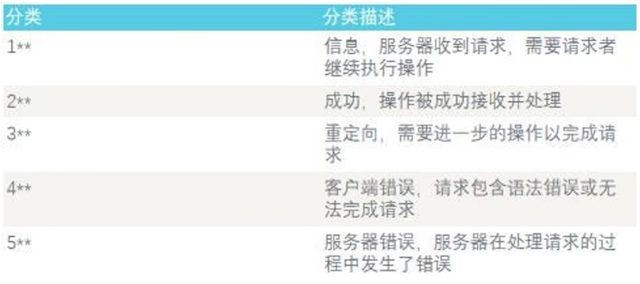
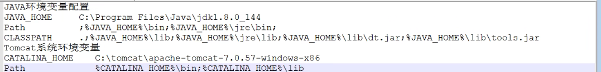

# 数据库

## 一、数据库的基本内容

数据库是指按照一定的数据结构（数据结构是指数据的组织形式或数据之间的联系）来组织、存储和管理数据的仓库，我们可以通过数据库提供多种方法来管理数据中的数据。

### 1）、数据库四类语言

* DDL
* DCL
* DML
* DQL

### 2）、基本概念

* DB：数据库
* DBMS：数据库管理系统：是统一管理数据库的软件，负责数据库的建立、操作和管理以及维护的软件系统
* DBA：数据库管理员
* 数据库系统
* 库、表、记录、字段
* 历程：人工管理-->文件系统-->数据库系统

### 3）、数据模型

1）模型转换：（现实世界）-->概念模型-->DBMS支持的数据模型-->物理模型

2）逻辑数据模型：

* 层次模型：树形结构组织数据（IMS）
* 网状模型：图形结构组织数据
* 关系模型：用简单二维表结构组织数据

3）组成要素：

* 数据结构：描述数据库的组成对象及对象间的联系
* 数据操作：检索、更新（插入、删除修改）
* 完整性约束：实体完整性、参照完整性、用户定义的完整性

4）关系模型的数据完整性约束

* 实体完整系：若为主属性，则不能为空
* 参照完整性：若是外码，要么空值，要么必须和组里的主值相同
* 用户定义完整系：针对某一具体关系数据库的约束条件

### 4）、LAMP

linux、apache、mysql、php

### 5）、数据库的类型

~~~shell
#关系型数据库
Oracle：(1521端口)(用户：SYS、SYSTEM)
SQL server：(1433端口)(user:sa)
MySQL：(3306端口)(user:root)
postgre：(5432端口)(user:postgre)
DB2：(5000端口)只适用于小的数据库
Access
~~~

~~~shell
#非关系型数据库
Nosql
MongDB
Redis：6379端口
~~~

### 6）、Mysql自带的数据库

四个数据库，分别是：

~~~mysql
# mysql：主要存储各类权限相关信息及帮助信息
# information_schema：主要存储数据库对象相关概要信息
# test:是一个测试用的空数据库
# performance_schema：主要存储配置及性能信息
~~~

~~~shell
#Mysql的四种注释方式
单行注释：# or - -（中间要带有一个空格才能生效）
多行注释：/*xxx*/
内联注释：/*！xxx*/
#内联注释
1、如果版本号大于或者比！后面的内容大，则执行
2、如果不是版本号，则执行
~~~

### 7）、数据库操作

常用的字符集

整性、浮点型

decimal(n,m)：共n位，有m位小数

字符型

日期类型

## 二、数据库操作

~~~mysql
#查看数据库
show databases;
#修改字符集
show character set;
alter database mysql character set utf8;
#创建数据库
create database school default character set gbk;
#选定数据库
use school;
#删除库
drop database qax;

describe name（表）
~~~

## 三、DDL（create、alter、drop）

~~~mysql
#创建表：
create table student(
name1 int(10) primary key;
name2 varchar(10) not null,
name3 datation default '2023',
unique(name3),
foreign key (name2) references course(name1)
)
#复制表
create table A like B；
create table A select * from B；（表和数据一起复制）
create table A select * from B where 1=1；（全部复制）
#删除字段
alter table A drop 字段名;
#添加字段
alter table B add 字段名;
#修改字段名
alter table A change 旧字段名 新字段名 新数据类型/modify（修改类型）
#修改约束条件
alter table A add constraint qax foreign key (sno) reference st1(sno);
or	alter table A add primary key(sno)
#删除约束条件
alter table A drop primary key；
alter table A drop index sno；
alter table A drop foreign key school；

~~~

## 四、DML（update、insert、delete）

~~~mysql
#插入一条记录
insert into student (sno,sex) value('xxx','xxx');
insert into student value
('xxx','xxx','xx'),
('xxx','xxx','xx');
#删除数据
delete from st where name='xx';
#更新
update st set sex=default [where name='n'];(括号内的内容可以不加)
~~~

## 五、DQL（select）

1、查询表达式

select A from B where [ ... ] group by [ C having [ ...] ] order by [ ... ]

* group 是进行分组的
* order by是用来排序的（asc是升序，desc是降序）
* 更名：select ‘name’ as “No”

~~~mysql
#限制条件limit
where ... limit 1,2；
where ... limit 2 offset 1;

#算数运算符
1、加减
2、and、or
3、where salary between 2000 and 3000;
4、where score in (21，22，33);
5、空查询：select * from student where Sage is null；
6、模糊查询：select * from course where Cname like 'j%';/_
7、数据排序：select * from score order by Cno asc，score desc；

#数据汇总
##聚合函数
1、不能用在where子句中
2、返回的都是单一的值

#条件转换-case函数：简单case函数/搜索case函数
select Sno，Sname，case Sage
when 25 then ‘成年’
when 23 then ‘成年’
when 16 then ‘未成年’
else ‘未知’
end as ‘是否成年’ from student；

#分类汇总
select Cno,avg(score) from score group by Cno having avg(score)>60;
select Cno,group_concat(Sno),avg(score) from score group by Cno;

#group_concat()/concat()
~~~

2、表的联系

~~~mysql
#一般格式
student.sno=score.sno;

#连接条件
select * from A，B where ...and...;
select * from A join B on A.cno=B.cno where Tname=‘lala’;
1、内连接
2、外连接：left join... on...
3、交叉连接

#联合查询：union（一个表中的不同两列数据）

#嵌套数据(子查询不能用order by)
select Cno from course where Tno in(select Tno from teacher where Tname=‘lala’)；

#比较运算符(子查询是单值，如果不是单值要用any和all)
#>.<.>=.<=.!=.<>
select Sno,score from score where cno='002' and score >any (select score from score where cno='001');
~~~

### 1、变量

* 系统变量（变量名前加@@、）区别：生存时间不一样
  * 全局系统变量
  * 会话系统变量
* 自定义变量
  * 用户会话变量（以@开头）
  * 局部变量（不以@开头）：需要以declare声明

~~~mysql
#查看系统变量的值：
1、show global variables；（全局变量）
	 show session variables； （当前会话相关的所有会话系统变量以及所有的全局系统变量）

#用户会话变量：
方法一：set @student_count=(select count(Sno) from student);
			select @student_count;
方法二：select @student_count:=(select count(Sno) from student);
方法三：select count(Sno) into @student_count from student;
~~~

### 2、函数

#### 1）数学函数

~~~mysql
ABS()：绝对值
ROUND(x)(x，D)：返回离x最近的小数，保留y位
floor()：小于该值的最大整数；
ceil()：大于该值
pow()：返回一个数字的值，到另一个数字的幂
rand()
~~~

#### 2）字符串函数

~~~mysql
#字符串连接函数
select concat ('java','sheji','ss');/concat_ws();
#字符串裁剪函数
ltrim(x)：去掉x开头的所有空格字符；
rtrim(x)：去掉结尾的空格字符；
trim(x)：开头和解为的空格字符；
left（x，n）：返回字符串前n个字符
right（）
#转换大小写函数
upper(x)：所有字母变成大写字母；
lower(x)：变成小写字母（原来的x不会变化）；
#取出指定位置的子字符串函数
substring(x,start,lengh)/mid(x,start,lengh):字符串x从start开始length长度；
#字符串替换函数
replace(x1,x2,x3)：x3替换x1中所有的x2；
#字符串比较函数
strcmp(x1,x2):比较x1和x2；
	（A的ascii码是65，a的ascii码是97）
#字符串的逆序
select recerse('abc')-->cba
#字符串格式化
format(s，2):将数据内容格式化为整数或者浮点数
~~~

#### 3）日期时间函数

~~~mysql
curdate() / current_date()
curtime() / current_time()
now() / current_timestamp() / localtime() / sysdate()
year()/month()/day()/hour()/minute()/second()
from_day(x)
datadiff(a,b)：用于计算a、b之间的相隔天数；
~~~

#### 4）系统信息函数

~~~mysql
version();
connection_id()：连接服务器的id
database() and schema()：当前操作的数据库
user()：获取通过哪一台主机、使用什么账户名成功连接MySQL服务
current_user()：获取该用户名允许通过那些登陆主机连接mysql服务器
~~~

#### 5）聚合函数

~~~shell
#聚合函数
COUNT(x);(只用COUNT*计算空格)
SUM();
AVG();
MAX();
MIN();
~~~

#### 6）加密函数

~~~mysql
#不可逆加密函数
password（x）：返回41位加密字符串
md5（x）：返回32位的加密字符串（彩虹碰撞）
#可逆加密函数
encode(x,key)decode(password,key)
aes_encrypt(x,key)aes_decrypt(password,key)
hex(x)/unhex(x)：十六进制转换
ascii(x)/char(x)：字符和ascii码的转换
~~~

## 六、DCL（grant、revoke）

* grant
* revoke
* commit用来提交事务
* Rollbct

创建用户：

~~~mysql
#创建用户：
create user ''@'host' [identified by 'passwd'];
#重命名用户：
rename user old-name to new-name;
#改密码：
set password for ''@'localhost'='newpasswd';
#删除用户
1、直接删除
drop user ''@'';
2、通过mysqluser表删除
delete from mysql.user where user='xh' and host='%'; 
#查看
select user，host form mysql.user

#用户标志
1、use表：最重要的权限表，记录允许连接到服务器的账户信息，权限是“全局级”的；
2、db表：存储了“用户”对某个数据库的操作权限；
3、host表：存储了某个“主机”对数据库的操作权限；
4、table_pr表：用来对“表”设置权限；
5、columns_pr表：用来对表的“某一列”设置权限；
6、procs_pr表：可以对“存储过程”和“存储函数”设置操作权限。
~~~

权限语句：

~~~mysql
启动：net start mysql
停止：net stop mysql
#权限管理命令
#1、创建用户并赋予权利：
grant all privileges on *.* to 'xh'@'%' identified by 'Admin@123' with grant option;
grant insert(sno.no.sex) on school.student to 'xh'@'%' identified by 'Admin@123' 
flush privileges;
#2、移除用户权限
revoke delete on *.* from 'xl'@'%';
#3、显示权限
show grants for xh；

###############################
#备份
mysqldump -u xh -ppasswd school > /etc/.../school.sql
mysql -u xh -ppasswd school < /etc/.../school.sql
or
mysqldump -u xh -ppasswd -B school > /etc/.../school.sql
mysql -u xh -ppasswd < /etc/.../school.sql
~~~

# 中间件概述

## 一、中间件的简介（middleware）

C:\Users\洛零\AppData\Roaming\Typora\typora-user-images

位置：操作系统 -> 数据库 -> 中间件 -> Web应用

中间件的作用：

1、用来屏蔽网络硬件平台的差异性和操作系统与网络协议的异构型。

2、在负载均衡、连接管理和调度方面起了很大的作用。

### 1、区分中间件、容器、服务器

1、web服务器（处理静态请求）

2、web中间件

3、web容器

中间件的组成部分，实现对动态语言的解析。

### 2、常见的中间件介绍

#### 1、IIS（内置于windows）：80端口

* 可以调用Dos命令，有一定的危险性。

#### 2、Apache：80端口

* 简单、速度快、性能稳定
* 不支持动态，可用插件

#### 3、Tomcat：8080端口

* 首先要部署JDK
* Web“应用”服务器，可以处理动态请求
* Apache 与 Tomcat 整合使用

#### 4、JBoss：8080端口

* 必须要用JDK
* 处理动态请求
* JBoss 支持 “热部署”

#### 5、WebLogic：7001端口

* 必须要用JDK
* 处理静态速度、部署复杂度排第一（占有最大份额）

#### 6、Nginx：80端口

* 高并发的服务器
* 支持热部署

### 3、proxy

* 正向代理：

类似一个跳板机，代理访问外部资源；架设在客户机与目标主机之间

* 反向代理：

将反向代理作为公网访问；架设在服务器端

* 负载均衡：

### 4、HTTP协议

Http状态码

## 二、中间件的配置

### 1、IIS安全配置

（c:\inetpub\wwwroot）根目录

### 2、Nginx安装

1、基础信息

~~~shell
#重要的文档
conf:配置文件
docs：说明文档
html：存放静态html文件
log：存储日志文件
temp：存放临时文件
~~~

### 搭建过程（使用命令打开关闭）

~~~shell
#一、开启&关闭Nginx
#1、查看进程
tasklist | findstr nginx
#2、杀掉进程
taskkill /f /t /im nginx.exe
#3、开启Ngnix
start Ngnix
~~~

~~~shell
#二、配置Nginx
#1、先关闭Nginx（在文件夹的路径里面输入cmd）
nginx -s stop（快速停止）/quit（有序停止）
#2、打开文件：/nginx/conf/nginx.conf
1、更改端口&主页文件：8012端口
2、在根目录创建新的目录：www；新建一个文档
	index.html
	配置添加在nginx.conf-->location
3、index.html:<h2>this is my first time to do it！</h2>
#3、重启Nginx
双击exe文件/start nginx
~~~

### 3、Tomcat安装

### 搭建过程（使用目录打开关闭）

重要的目录：

~~~shell
#bin：存放启动和关闭tomcat的脚本文件
	.bat为windows上的文件，.sh是linux上的文件
	startup文件：检查
	catalina.bat/sh执行所需环境
	catalina
	shutdown
	tomcat8文件：
	tomcat8w文件：图形化控制Tomcat
#conf：服务器配置文件
	server.xml最重要的配置文件
	tomcat-user.xml：管理员的配置文件
#lib：存放Tomcat服务器的支撑jar包
#logs：日志数据
	caralina.日期.log：控制台日志
	commons-daemon.日期.log：启动、停止对tomcat的操作日志
	host-manager
	localhost_access_log：用户请求TOMcat的访问日记
#temp：存放运行时产生的临时文件
#webapps：web应用所在的目录，供外界访问的web资源存放目录
#work：Tomcat的工作目录
~~~

~~~shell
#测试：
1、java -version
2、javac
~~~

~~~shell
#一、环境变量配置
#1、JDK安装路径
#2、PATH：各个程序的路径:在我的电脑的属性-->高级属性里面设置
	a：新建环境变量:JAVA_HOME /jdk目录
	b: 在Path环境变量中添加路径：
	;%JAVA_HOME%\bin;%JAVA_HOME%\jre\bin；
	c：新建CLASSPATH环境变量：
.;%JAVA_HOME%\lib;%JAVA_HOME%\jre\lib;%JAVA_HOME%\lib\dt.jar;%JAVA_HOME%\lib\tools.jar
#3、CLASSPATH：java各个类的路径
	a:【CATALINA_HOME】 C:\tomcat\apache-tomcat-7.0.57-windows-x86
	b:【Path】 %CATALINA_HOME%\bin;%CATALINA_HOME%\lib； 
~~~

~~~shell
#改端口：conf/server
#添加用户：conf/user
#热部署：war包
#在sever（149行）添加主页地址
<Context path='' docBase='C:/tomcat/apache-tomcat-7.0.57-windows-x86/www' debug='0' />
#修改展示的页面：conf/web-->http://IP:port/manager
最底下的页面<welcome>...one.txt
#关闭热部署功能：改成两个false：conf/server
http://IP:port/文件名

~~~

### 4、Apache简介

~~~shell
#主目录配置
1、Conf：配置文件目录
2、htdocs：网页文件目录
3、Logs：日志目录
	access.log:访问记录
	error.log错误日志
	install.log安装日志
###日志的位置
linux：/var/log
windows：安装目录/log
~~~

### 搭建过程(使用图标打开关闭)

~~~shell
#修改配置
1、修改网站根目录
2、修改端口
#修改顺序
#1、安装apache
1、安装apache
#2、解压php，将php与Apache连接
1、在/apache/conf/httpd 文件中编写（找到php下php5apache2_2.dll的路径）
LoadModule php5_module "C:/WAMP2/WAMP/php5apache2_2.dll"
AddType application/x-httpd-php .php
PHPIniDir "C:/WAMP2/WAMP"
2、编写php网页，写在htdoc，并打开网页测试
	<?php echo "1.php";?>
3、解压软件包phpmyadmin在htdoc（修改php配置，并添加mysql扩展）
#3、安装mysql（文件名短的那个），将mysql与Apache连接
1、修改php文件夹下面的php.ini.development，删掉后面的development（devel用来测试，prod用来开发）
2、进入php.ini并设置ext的文件路径，并取消两个mysql的注释（809行、959行）and mysql-string
4、测试是否可以打开127.0.0.1/phpmyadmin
#4、修改端口
1、httpd文件47行（listen）
2、修改主页文件夹:<Directory "phpmyadmin的文件夹">（210行）
	DocumentRoot “phpmyadmin的文件夹”(183行)
3、修改主页：DirectoryIndex index.html index.php（245行）
###测试：
https -t（如果启动不成功）
~~~

### 5、JBoss简介

重要的文件夹：

~~~shell
#重要的文件夹
1、bin：启动脚本和启动配置文件（standalone.bat/关闭就叉掉对话框）
		standaloned.xml：
				默认端口（<socket...>）
				开启热部署：<deployment-scanner......true>不能关闭
				默认页面
2、bundles：存放OSG|bundle
3、docs/schema：存放XMLschema定义文件
4、domain：域的内容
5、modules：放置各种模块
6、standalone：配置文件、热部署
7、welcome-content：默认页面
~~~

### 搭建过程（使用bin打开关闭）

~~~shell
#搭建过程
1、创建环境：要有java环境
2、解压缩包
3、更改接口&绑定：standalone
4、更改热部署（116行）：deployment-scanner后面
auto-deploy-exploded='true'
5、关闭默认界面（243行）
enable-welcome-root=“false”
6、更改热部署目录设为默认页面
	/standalone/deployments/one.war/WEB-INF/jboss-web.xml
###jboss-web.xml文件内插入内容
<?xml version="1.0" encoding="UTF-8"?>
<jboss-web>
	<context-root>/</context-root>
</jboss-web>
~~~

