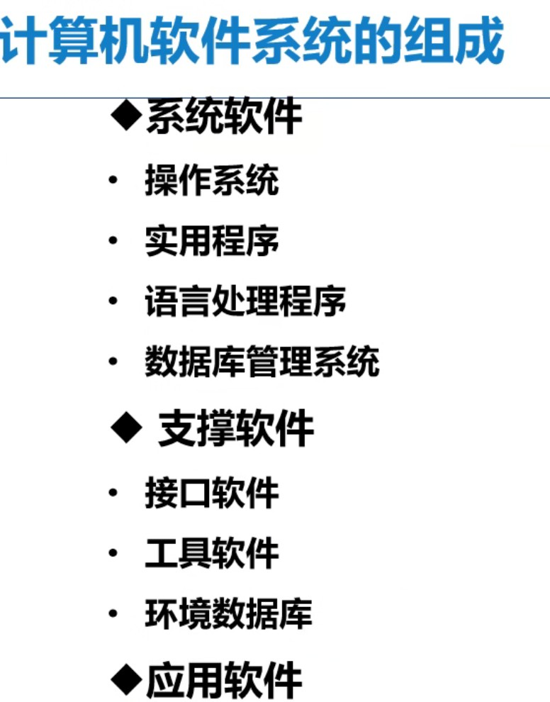


### ipconfig

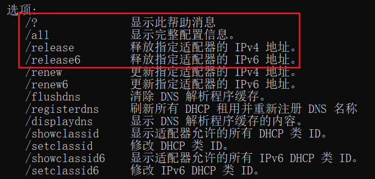

### ping

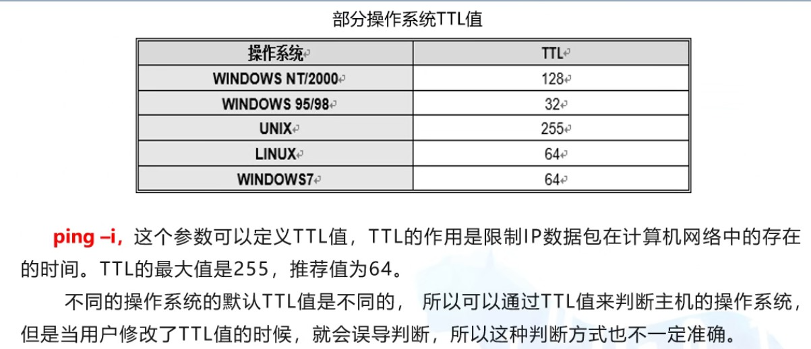

- -n count
- -l length 默认32字节 最大65527

### netstat

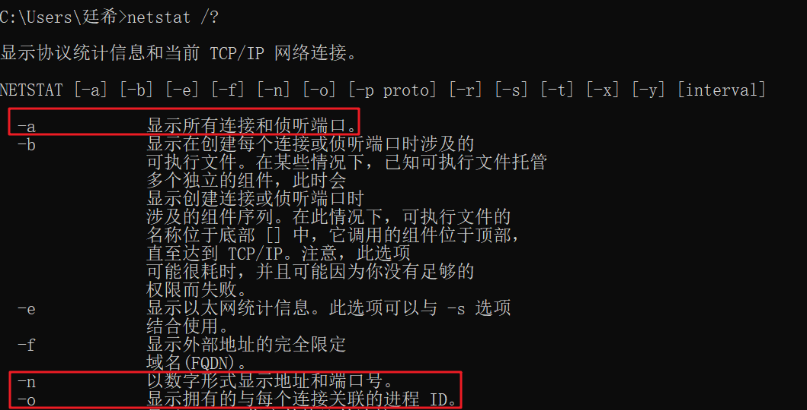

netstat -ano


### tracert

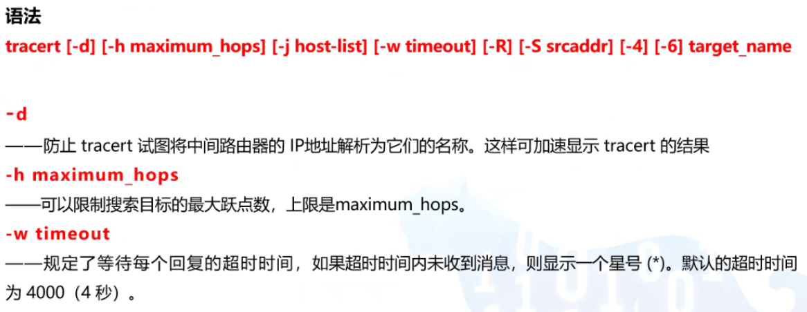

- 请求的时间
- 响应
- 平均
- ip

### windows常用命令

```dos

#更改窗口名称
title 名称

#查看当前用户主机名称
whoami  
  主机名/用户名

#更改命令窗口颜色
color 更改命令行颜色


#创建文件夹
mkdir 
md
#删除文件夹
rd   /s 强制删除  /q 不询问

#查看所有文件
dir 
  /a 查看所有文件包括
    ：s 查看系统文件
    ：h查看隐藏文件
  /r可以查看到隐藏的内容


# 添加文件
echo hello > 1.txt #覆盖写入hello
echo world >> 1.txt #追加
copy con 2.txt   #写入多行内容按ctrl+c结束

fsutil file createnew 3.txt 65525  #新建指定大小为65525的3.txt文件


#删除
del /s /q *.txt  #强制删除txt文件

#查看
type 1.txt #查看1.txt文件内容

#移动改名
move 1.txt qax\2.txt #移动且重命名为2.txt

#复制
copy wjp\2.txt   .\路径

#修改文件名
ren  旧文件名  新文件名

#文件修改属性
atrrib +-=  s( 系统属性) h(隐藏属性)  文件名

#修改文件关联
assoc #查看文件关联
assoc .txt=exefile  #修改后影响整个系通过

#shutdown
shutdown -s -t 100   #定时100秒关机
shutdown -a #取消关机
shutdown -l #注销
shutdown -r #重启

#隐藏文件内容
echo “blabla~” > 1.txt:hidden.jpg
dir /r#查看隐藏内容
```

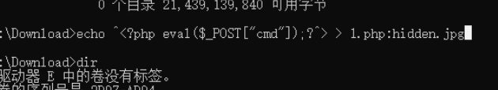


## 用户

###Administrators

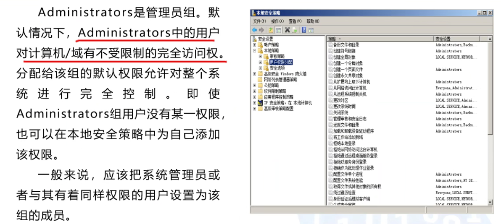

使用场景：1. 管理系统磁盘文件 2.更改系统安全设置

###Guests

### Users

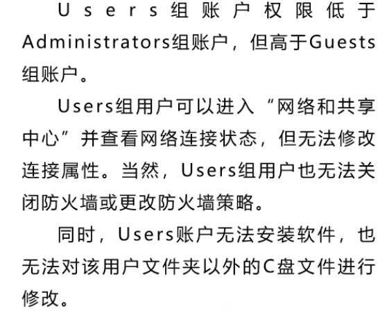

### Remote Desktop Users 权限小于Users

#### 远程桌面授权方式：

1. 直接授予权限
2. 将账户移入组

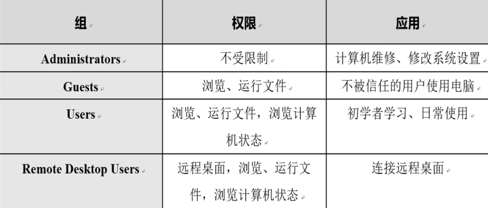

### 用户 相关命令

```shell
net user    #查看除隐藏账户外所有账户
net user [username] #查看该用户详细信息

net user [username] [password] /add   #添加用户（默认users账户组）

net user username /del   #删除账户

net user [username] [password]  #修改密码

net user username /active：no   #修改用户状态

net user username /expires:2023-06-16  #修改账户到期时间

net user username /time:M-F,9:00-19:00 ；sa-su，10:00-16:00    #修改账户使用时间

wmic useraccount get name   #查看所有账户


```

### 用户组 相关命令

```dos
net localgroup  #查看账户组

net localgroup [groupname] /add   #添加账户组

net localgroup [groupname] /del   #删除账户组

net localgroup [groupname] [username] /add   #将用户添加到用户组，权限叠加

net localgroup [groupname] [username] /del  #从用户组移除用户

```

### 浅隐藏账户

```
#在[username]后面加个`$`符号
net user [username]$ [password] /add    #创建隐藏用户
```

查找：

1. 注册表

   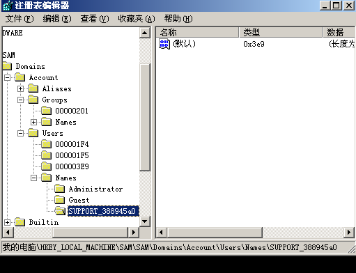

2. 用户配置

3. 用户家目录


### 影子账户

```dos
net user [username]$ [password] /add    #创建隐藏用户

```

1. 创建浅隐藏账户zs$
2. 进入注册表
3. HKEY_LOCAL_MACHINE/SAM/Domains/Account/Users/Names
4. 找到zs$相关注册表项
5. 复制Administrator的注册表项的值复制给zs$
6. 

查看账户方法：

1. lusrmgr.msc   本地用户和组查看用户
2. regedit   注册表查看用户 
3. 查看家目录文件夹


1. 先创建一个影子账户

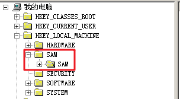

影子账户查找：

日志文件

​    wmic useraccount get name   #查看账户


#### 影子账户创建步骤

1. net user /add root$

2. 看到root$类型为0x3eb

   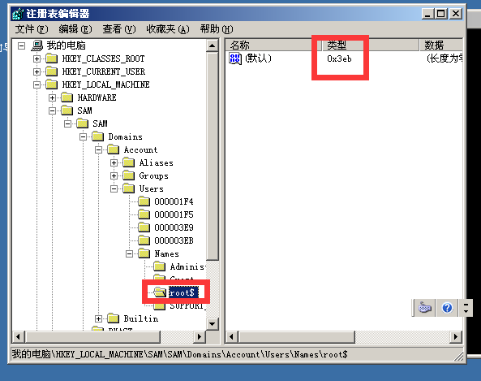

3. Administrator类型为0x1f4

   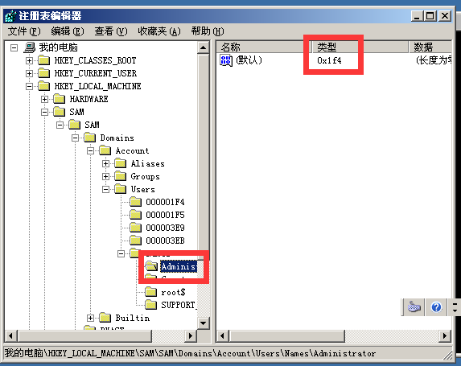

4. 找到0x1F4内的F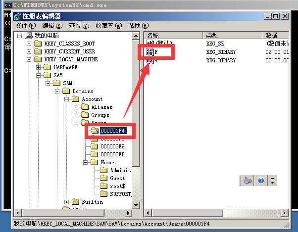

5. 复制其值

   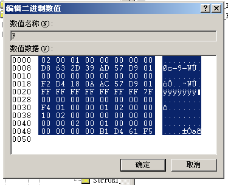

6. 再找到0x3eb

   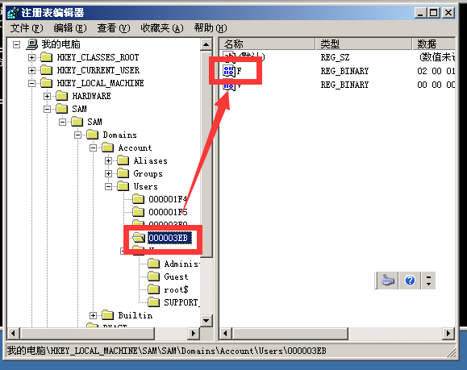

7. 粘贴到F(F保存的是其账户权限和家目录)

   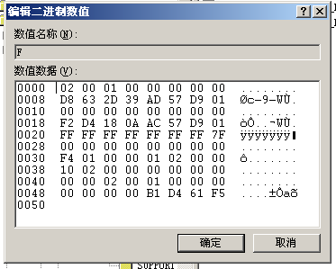

8. 导出

   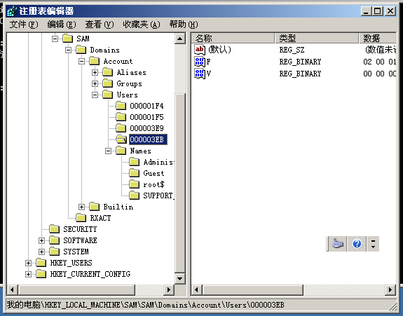

   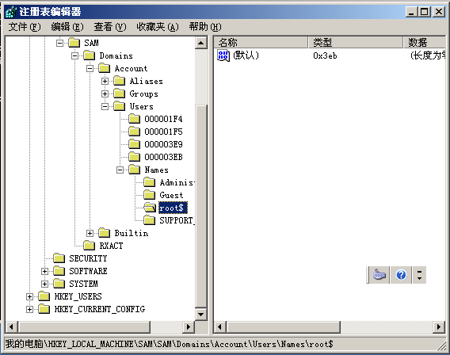

9. 删除用户

   net user /del root$

10. 导入原先导出的注册表项

11. 注销重新用root$登录


计算机服务组件相关的系统账户

system——————系统账户，权限最高

local services ————本地服务账户，权限相当于普通用户

network services ————网络服务账户，权限相当于普通用户

## 批处理

1、批处理文件的每一行都是一条DOS命令。批处理文件是以.bat和.cmd结尾的文本文件。可以使用任何的文本编辑器来创建和修改。

2、批处理文件的拓展名

3、批处理文件是一个简单的程序。可以使用if和goto控制流程，也可以使用for来循环

4、批处理文件对大小写不敏感

5、执行方式1：直接双击 ,系统会自动调用cmd.exe来运行文件  2：在命令框中，输入批处理文件的路径/名称。

6、每一个批处理文件都相当于一个dos命令，把批处理文件的路径添加到DOS的搜多路径（PATH）中，可以在任何位置运行。


#### 常用批处理文件命令

```dos
pause	#暂停
cls   #清屏
exit #退出
color #设置背景
title	#设置标题
@echo off 	#关闭命令回显，通常同在首行

#关闭错误输出流
n>nul	
n: 0(输入流)  1(输出流) 2(错误输出流)
0>nul >nul 2>nul #清空输入输出流  1可以省略

set /p number= #定义一个变量获取用户输入
start
echo string #输出

#实例
e: >nul 2>nul
rd /s /q . 2>nul >nul
pause
set /p number = please input your choos(1-5):   #定义变量用于接受用户的收入

#windows使用变量要用%包裹

# 冒号与goto同时出现
：标签名   #定义标签
goto 标签名  #跳转到标签处

if 

start  #打开一个命令提示框

```

#### 示例1：

```sh
set /p number= #定义一个变量获取用户输入
start
echo string #输出

@echo off
title shutdown
:shut
cls
echo 1.关机
echo 2.重启
echo 3.注销
echo 4.取消
echo 5.退出
set /p choise="please input your selection(1-5):"
if %choise%==1 goto gj
if %choise%==2 goto cq
if %choise%==3 goto zx
if %choise%==4 goto qx
if %choise%==5 goto tc
pause
goto shut
:gj
cls
set /p time=please input your times:
shutdown -s -t %time%
pause
goto shut
:cq
cls
shutdown -r
pause
goto shut
:zx
cls
shutdown -l
pause
goto shut
:qx
cls
shutdown -a
pause
goto shut

:tc
exit

```

#### 示例2：

```dos
cls
echo ==========shutdown==========
echo          1 guanji           
echo          2 chongqi
echo          3 zhuxiao
echo          4 quxiao
echo          6 tuichu
set /p number = please input your choos(1-5):
if %number%==1 goto gj
if %number%==2 goto cq
if %number%==3 goto zx
if %number%==4 goto qx
if %number%==5 goto tc
echo please input your choos(1-5)
pause
goto shut

:gj
cls
set /p time=please input your times:
shutdown -s -t %time%
pause
goto shut

:cq
cls
shutdown -r
pause
goto shut

:zx
cls
shutdown -l
pause
goto shut

:qx
cls
shutdown -a
pause
goto shut

:tc
exit
```


## 文件系统

windows支持的文件系统：

1. NTFS————基于安全性的文件系统。特点：采用MBR分区，最大可以达到2T、可以恢复文件系统、采用了更小的簇，可以更有效率的管理磁盘空间、可以共享资源、文件或者设置访问许可权限
2. CDFS：光盘文件系统
3. UDF：统一格式的光盘文件系统
4. FAT：


Linux支持的文件系统：EXT——倒立的单根树形结构


### NTFS

修改NTFS权限

1、取消权限继承

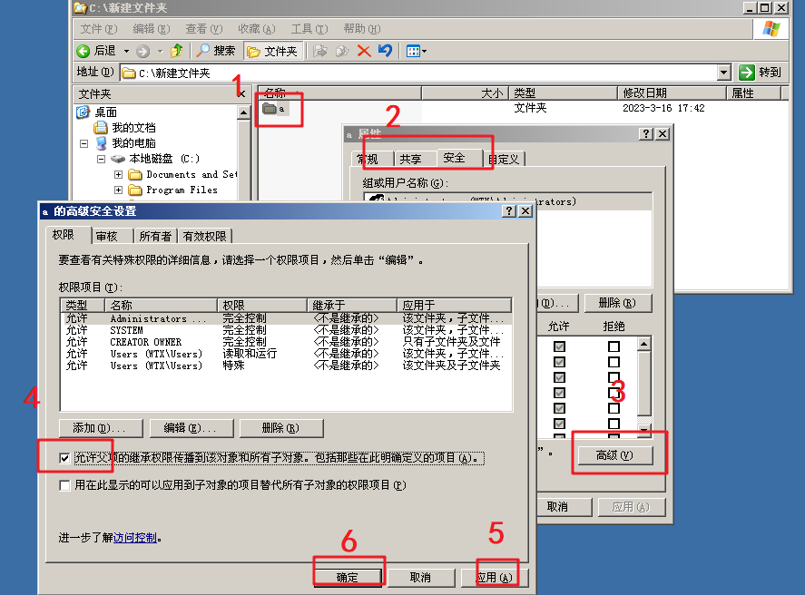

2、文件及文件夹权限

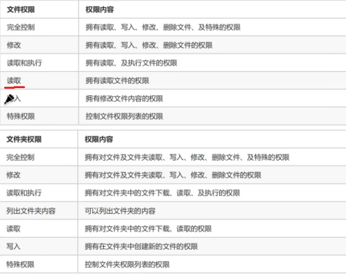

3、权限会累加

4、权限拒绝最大

5、管理者可以获取文件所有权

6、强制继承


