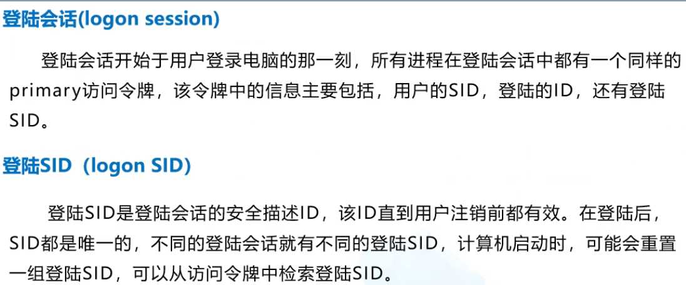
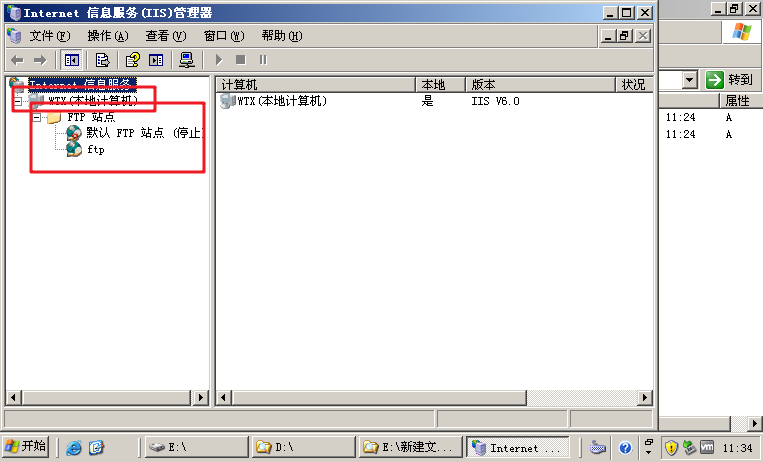
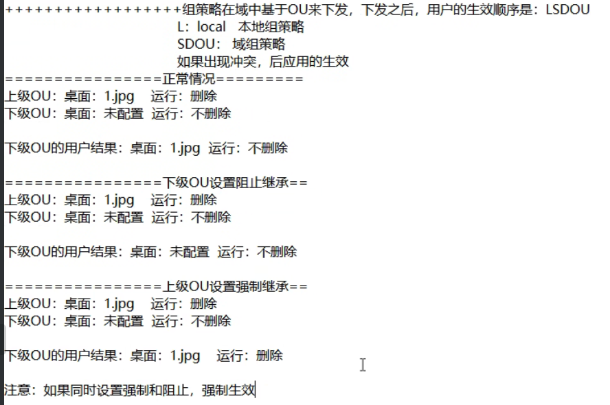

###  Windows访问控制

通过==身份验证（SID）==和==授权相关==的机制来控制系统和网络资源的使用。（SID随着账户的创建删除）


SACL保存对文件的访问记录


多个ACE（访问控制项）组成一个ACL


1、安全对象，没有DACL————允许所有用户的任何访问

2、安全对象，有DACL，没有ACE————拒绝所有用户的任何访问

3、安全对象，有DACL，有ACE————根据ACE逐条对比





### 文件共享

通过网络提供网络的共享服务，提供文件的上传和下载。使用协议：CIFS 

本地路径：C:\文件名

网络路径：\\\\ IP\共享名 （共享名不能设置为中文）

注意：

1. 通过本地路径访问时，只由NTFS权限控制
2. 通过网络路径访问时，权限由NTFS和共享权限共享控制，取交集
3. 建议将共享权限设置为Everyone完全控制，具体权限由NTFS设置

 保证客户机ping通服务器、不需要服务器ping通客户机

#### 网络共享实验

1、网络共享权限完全控制


（共享名不能为中文）


2、关闭文件权限继承


3、设置相应NTFS访问权限


### 享资源相关命令

```dos
net share   #共享命令
#后面有$为隐藏共享

#1、临时关闭共享 (临时关闭，重启恢复)
net share [sharename] /del
#2、永久关闭，修改注册表，永久生效


```


#### 隐藏共享

设置和访问都是在后面加$符号


####永久关闭共享


### IPC$


SMB     TCP ==445端口号== 或 ==139端口==


## 远程服务端口

Telnet      23

远程桌面    3389

### FTP     21


#### FTP隐患：

1、端口     21端口容易被病毒使用、容易被知道服务————修改端口号

2、明文传输      容易被窃听，收到中间人攻击————在传输层进行加密ssl

3、匿名机制       关闭      ———— 做权限限制（最小权限原则）


#### FTP搭建

1、检查网络是否通畅

* 检查网卡
* 检查IP地址

2、安装FTP服务

* 检查镜像是否在


依次选择找到FTP服务后勾选确定




关闭匿名账户：


#### 安全性配置

- 更改端口
- SSL证书
- 取消匿名访问/NTFS处做权限控制
- 日志发送到单独的日志服务器


### Telnet 23


#### Telnet隐患

1、明文传输  ————传输层加密————SSL

2、端口     23   不使用关闭、使用修改（1~1023）

3、接口     防火墙限制IP访问

4、日志安全  日志服务器

#### 启用telnet

1. win+r
2. services.msc
3. 启动telnet服务

```sh
TELNET 192.168.*.*
tlntadmn [\\RemoteServer] config [port=Integer] [-u UserName -p Password] 
#更改telnet端口
#在服务端需把账户添加到TelnetClients组
```


### 远程桌面连接 3389


### DHCP  UDP 67、68

分配方式：手工分配、动态分配、静态分配

UDP 67、68 为默认DHCP服务端口

67用来接受下级客户请求分配IP，68是向客户发送请求成功或者失败回应


如果当前没有服务器响应，客户机会自己给自己分配一个IP地址169.254.X.X/16,属于全球同一的无效地址。只用于临时的内网通讯。

ipconfig   /release 释放IP      /renew   重新获取IP   （本身有IP时，发送Request报文，进行续约。没有IP时，发送Discover获取IP）


#### DHCP欺骗的攻击与防御

##### 1、攻击DHCP服务器

方式：频繁发送大量伪造的DHCP请求，指导把DHCP资源地址池耗尽

防御：在交换机的端口上做动态MAC地址绑定

##### 2、伪装DHCP服务器攻击DHCP客户机

方式：通过把自身部署成DHCP服务器，为客户提供非法的IP地址或者DNS地址

防御：在管理型的交换的端口上做动态MAC地址绑定，除合法DHCP服务器所在的接口外，全部禁止发送DHCPoffer报文。


1、保证网络在同一连接模式

2、关闭宿主机DHCP服务器

3、DHCP服务器为静态IP地址

4、安装DHCP服务

5、激活作用域


### DNS    53 


- **网络客户端：**缓存 -> 本地hosts -> 本地DNS服务器地址
- **本地DNS服务器：**缓存 -> 本地区与解析文件 -> 转发器 -> 根域名服务器
- **正向解析：**已知域名查找IP地址(A记录)
- **反向解析：**已知IP地址查找域名(PTR记录)
- **CNAME：**域名的别名
- **AAAA：**IPV6

域结构：倒立的树形结构，根


完全限定域名：主机名.域名   （常用在域里面）


#### DNS劫持后果：

1、无法访问 2、访问到虚假地址

排查：换DNS   nslookup  [name]

#### DNS污染：

域名一直无法访问


#### 搭建DNS服务

1、网络通畅

2、DNS服务器使用静态地址IP1     DNSIP IP1

3、添加DNS服务

4、 区域名不能随便设置


辅助区域：

03主DNS服务器  静态IP：IP1  DNSIP：IP1 区域类型：主要区域

08辅助DNS区域  静态IP：IP3   DNSIP：IP1 区域类型：辅助区域

注意事项：==辅助区域的名称要一致==

08想要复制需要经过03允许

授权—通知+复制

1、网卡相同    网段相同  08DNS要指向主DNS   ping

2、添加服务器组件


转发器指向主DNS


主DNS服务器：可以处理DNS请求的服务器

辅助DNS服务器：复制主DNS服务器的区域解析文件，做备份

转发器：将自身无法处理的DNS请求转发给指定的DNS服务器处理


条件转发器只能转发正向域名解析


03 day

###  SMTP   25

SMTP主要用于发送邮件，工作在应用层。


#### SMTP 隐患

* 明文传输
* 显示发送人可以更改，真实发送人不可更改
* 端口

发送端：用户名、密码、

协议：邮件伪造——垃圾邮件（邮件服务器为对发送端做身份认证）——身份认证、明文传输

邮件服务器：端口25——更改、常见web漏洞

接收端：钓鱼邮件

预防钓鱼邮件：服务器：域解析（链接）、沙箱（附件）

#### 防御

- 服务器：预解析/沙箱机制
- 发送端用户密码(强密码、定期修改)
- 协议：
  - 邮件伪造 – 垃圾邮件 身份认证
  - 明文传输
- 邮件服务器：
  - 端口  –关闭25/改为一个不常用的端口号
  - 常见web漏洞
- 接收端：钓鱼邮件 – 谨慎点击

###  POP3   110

 

###  IMAP    143 

未读邮件不用全部下载可以由用户选择下载

三种协议都是明文传输


### SSL  应用层加密

### SSH    22 


###HTTP    80	

明文传输

###  HTTPS      443	


   SSL 安全套接层

1、中间件：apache、tomcat、

2、windows内置的IIS （FTP、DHCP、DNS）

3、第三方软件    phpstuby


增加安全性：


## AD服务和域


域内设备通过域管理器来实现管理

AD是工作环境   域是网络

### AD服务作用


A记录只记录IP地址

SRV记录可以记录IP地址和端口号


*** 组策略只能管理域内计算机和用户 ***


修改组策略要重启生效，


### 组策略：

对于用户的组策略配置项的更新，需要用户注销后在登陆才会生效

对于计算机的组策略配置的更新，需要计算机重启才会生效


组策略在域中基于OU来下发，下发之后，用户的生效顺序是：LSDOU      L：local 本地策略  SDOU：域组策略  如果出现冲突后应用的生效

组策略在域中基于OU来下发，下发之后用户的生肖顺序是：**LSDOU**

- L：lucal 本地组策略
- SDOU：域组策略
  - S：站点
  - D：域
  - OU：组织单元
- 如出现冲突，后应用的生效



1、域和活动目录的关系

* 活动目录是域的基础
* 活动目录是域的实现方法
* 域是一种逻辑上的组织形式

2、域和工作组的区别

* 工作组：默认的管理模式，自己管理自己，大型网络中不方便管理
* 域：集中管理，统一管理，主从管理

3、域的逻辑结构

* 倒立的单根属性结构——需要依赖于DNS的域名解析

4、域的物理结构

* 域控制器
* 站点，域成员机

5、信任关系——用来域之间的资源访问

* 单项不可传递
* 双向可传递

6、域的管理——组策略

组策略——组策略对象（GPO）——OU ——计算机重启、用户注销


7、域的部署

* 安装活动目录（AD）——就成了域控制器（DC）
* 安装域控（AD）——就有了域环境
* 域会自动安装DNS


gpedit.mscd   打开组策略编辑器


### 域实验


GPO只能作用于OU  

权限只能作用于组


配置：

1、配置两个OU

gpmc.msc


