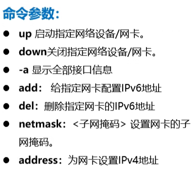
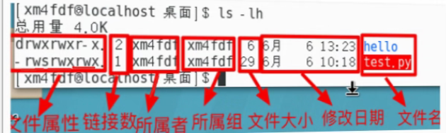

# linux

## init进程


## 关机命令

### shutdown

-F 强制关机

-r 关机重启


### poweroff

### init 0


## 重启命令

### reboot


### init 6

### shutdown  -r


## 注销命令

### logout

### exit


## Linux密码找回

按e

r/o 改为r/w

init改为init=/bin/bash


按Ctrl+s保存

passwd 回车输入密码


出现编码错误 lang = en

写入引导文件

touch /.autorelabel

exec /sbin/init  使用默认启动级别启动计算机


## 常用命令

```she
# 关机
shutdown 
poweroff
init 0
# 重启
reboot 
init 6
shutdown -r
# 注销
logout
exit
#服务
service 服务名 控制类型
systemctl 控制类型 服务名
控制类型 -> start(启动) restart(重启) stop(关闭) static(查看状态) enable(开机自启) disable(关闭开机自启)
#网络
ifconfig [网络设备] [参数]
ifconfig #处于启动状态的网卡配置信息
    up #启动指定网络设备/网卡
    down #关闭指定网络设备/网卡
    -a #显示全部接口信息
    add #给指定网卡配置IPv6地址
    del #删除指定网卡的IPv6地址
    netmask #设置子网掩码
    address #为网卡设置IPv4
ifdown ens33
ifup ens33
netstat
#用来查看网络连接情况 路由表信息 接口状态
 -a 显示所有选项，默认不显示LISTEN相关。
 -t 仅显示TCP相关选项
 -u 仅显示udp相关选项
 -l 处于监听状态
 -alt 处于监听状态的TCP连接
#ping
ping 
    -c 发送包的次数
    
#文本编辑器
vim
  #命令行模式(不会回显在屏幕)
      #所有的字符串都作为命令处理
      P 复制
      dd 粘贴
      yy 删除
  #文本输入模式
      i 插入
      a 追加
      o 打开
      c 修改
  #末行模式(会回显在屏幕上)
  :
  set number #显示行号
  w 保存
  q 退出
  ！ 强制
  n,md #删除从n到m
cat
chgrp
chmod:
  u、g、o  +-=
  
file:
    -b 列出辨识结果时不显示文件名称
    -c 详细
    -L
    -z
mv: #移动/重命名
rm：#删除
    -r #递归删除
    -f #强制删除
touch #创建文件
    -d
cp #复制
    -p:#文件名、属性、权限不变
cd #切换路径
    cd - #上一工作目录
ls #查看目录结构
    -l 以列表的形式
    -a 所有文件
passwd #修改密码
    -l #禁用 
    -u #启用
    -S #显示密码信息
    -d #删除密码
useradd #添加账户
    -u #指定UID
    -g #指定所在组
    -e #指定到期时间
last #显示开机以来登入者信息

gunzip #解压
gzip #压缩
tar
 -zcvf [压缩文件名] [待压缩文件/目录名] #打包压缩文件
 -zxvf #解压
 
ps #查看进程
    -A #显示所有进程
kill #关闭进程
    -9 #强制关闭
top #显示系统当前进程和其他状况
    d
    
df #系统磁盘空间占用情况
du #文件系统的磁盘空间占用情况
```


## Linux网络配置

* /etc/sysconfig/network-scripts/目录下
* 


onboot 是否启用这个网卡

动态获取IP更改bootproto 为“DHCP”


service 服务名   控制类型

systemctl  控制类型  服务名

控制类型：

* restart  重启
* start     开启
* stop      停止
* status    查看状态
* enable     开机启动
* disable    开机禁用


route 查看路由表

flags 是否启用U启用  UG默认路由  


### 配置DNS


缓存——hosts文件——网卡配置文件找DNS服务器——resolv.conf文件

hosts文件 IP地址和域名的映射


host.conf     记录DNS解析顺序


resolv.conf 记录的是DNS主机


- 方法一
  1. vim /etc/sysconfig/network-scrips/ifcfg-eth0
  2. DNS1=114.114.114.114
  3. DNS2=8.8.8.8
  4. 重启网络服务
- 方法二
  1. vim /etc/resolv.conf
  2. nameserver 114.114.114.114
  3. nameserver 8.8.8.8
- 重启网络服务时 系统会自动把方法一的DNS写入到方法二的文件中
- 顺序
  - 缓存 - > hosts ->网卡配置文件 - > resolv.conf
  - 定义在host.conf


### ifconfig

查看和配置网络设备，配置是临时的。

ifconfig [网络设备] [参数]



down只能关闭数据流，关闭网卡要删除路由信息


### netstat


### ping 

不手动停止则一直发送

ping -c 3 IP/domain


### VIM


* 命令行模式 


P 复制     dd  粘贴     yy  删除

* 文本输入模式


* 末行模式转移模式


命令会回显到屏幕上作为命令来处理

setnumber ：显示每一行的行号esc回到命令行模式

w 保存  q  退出  ！强制


ifdown

ifup


netstat -alt |grep ssh


## 其它

### 目录

file  、   ls -l   以列表形式查看文件


/bin 存放基本命令的二进制文件

/boot 存放系统启动的

/dev   存放设备文件

/etc  系统配置文件

/lib 存放库文件

/media  存放移动设备挂载点目录

/mnt 文件系统的临时挂载点

/opt  第三方软件存放路径

/sbin 管理类的命令的二进制人间

/tmp  临时文件目录

/var  存放系统经常变动文件   /var/log存放系统日志


/usr    目录存放手动安装应用目录


* /：根目录，**一般根目录下只存放目录**，在 linux 下有且只有一个根目录，所有的东西都是从这里开始
  * 当在终端里输入 `/home`，其实是在告诉电脑，先从 `/`（根目录）开始，再进入到 `home` 目录
* /bin、/usr/bin：可执行二进制文件的目录，如常用的命令 ls、tar、mv、cat 等
* /boot：放置 linux 系统启动时用到的一些文件，如 linux 的内核文件：`/boot/vmlinuz`，系统引导管理器：`/boot/grub`
* /dev：存放linux系统下的设备文件，访问该目录下某个文件，相当于访问某个设备，常用的是挂载光驱`mount /dev/cdrom /mnt`
* /etc：系统配置文件存放的目录，不建议在此目录下存放可执行文件，重要的配置文件有 
  * /etc/inittab
  * /etc/fstab
  * /etc/init.d
  * /etc/X11
  * /etc/sysconfig
  * /etc/xinetd.d
* /home：系统默认的用户家目录，新增用户账号时，用户的家目录都存放在此目录下
  * `~` 表示当前用户的家目录
  * `~edu` 表示用户 `edu` 的家目录
* /lib、/usr/lib、/usr/local/lib：系统使用的函数库的目录，程序在执行过程中，需要调用一些额外的参数时需要函数库的协助
* /lost+fount：系统异常产生错误时，会将一些遗失的片段放置于此目录下
* /mnt: /media：光盘默认挂载点，通常光盘挂载于 /mnt/cdrom 下，也不一定，可以选择任意位置进行挂载
* /opt：给主机额外安装软件所摆放的目录
* /proc：此目录的数据都在内存中，如系统核心，外部设备，网络状态，由于数据都存放于内存中，所以不占用磁盘空间，比较重要的文件有：/proc/cpuinfo、/proc/interrupts、/proc/dma、/proc/ioports、/proc/net/* 等
* /root：系统管理员root的家目录
* /sbin、/usr/sbin、/usr/local/sbin：放置系统管理员使用的可执行命令，如 fdisk、shutdown、mount 等。与 /bin 不同的是，这几个目录是给系统管理员 root 使用的命令，一般用户只能"查看"而不能设置和使用
* /tmp：一般用户或正在执行的程序临时存放文件的目录，任何人都可以访问，重要数据不可放置在此目录下
* /srv：服务启动之后需要访问的数据目录，如 www 服务需要访问的网页数据存放在 /srv/www 内
* /usr：应用程序存放目录
  * /usr/bin：存放应用程序
  * /usr/share：存放共享数据
  * /usr/lib：存放不能直接运行的，却是许多程序运行所必需的一些函数库文件
  * /usr/local：存放软件升级包
  * /usr/share/doc：系统说明文件存放目录
  * /usr/share/man：程序说明文件存放目录
* /var：放置系统执行过程中经常变化的文件
  * /var/log：随时更改的日志文件 
  * /var/spool/mail：邮件存放的目录
  * /var/run：程序或服务启动后，其 PID 存放在该目录下


### 文件类型




- \- 普通文件
- d 目录
- c 字符设备文件
- s套接字文件
- p 管道文件

### 用户

超级用户 # UID 0

普通用户 $ UID 500-65535

虚拟用户   UID 1-499  系统

su  直接切换

sudo 临时授权

```
#赋予sudo 权限
   /etc/sudoers
```


### 文件权限

1、普通权限

目录权限：


chmod  用于修改文件权限，只有root用户和文件所有者可以修改

读4、写2、执行1


chmod +/-rwx 文件名|目录名

chmod u+x,g-w,0-r hello.txt 


2、特殊权限

SUID 进队二进制文件有效				

 标志位：U x->s 

效果：其他用户执二进制文件时具有文件所有者的权限

/etc/shadow  密码配置文件只有root有权限


SGID 仅对二进制文件和目录有效 				

标志位：G x-> s

对二进制文件效果：其他用户执二进制文件时具有文件所有在组的权限

对目录效果： 其他用户在该目录创建文件，组权限为目录所在组


SBIT 仅对目录有效				

标志符 ：  o x-> t

效果：目录下的文件只有文件的拥有者和目录的拥有者可以增删改查


chmod 修改权限

8进制数设置：

SUID 4、SGID 2、SBIT 1 

chmod  4751  1.txt   :第一位代表冒险位强制位 用来表示特殊权限

用符号设置：

chmod u+s 1.txt    shmod g+s 1.txt    chmod o+t 1.txt


3、隐藏权限

lsattr 查看文件的隐藏权限

chattr  修改权限


- 保证数据完整性

- lsattr查看隐藏权限

- chattr修改文件隐藏权限

- \+ - = 三种方式

  - **i** 无法对文件进行修改，若对目录设置后则仅能修改子文件而不能新建或删除
  - **a** 只能追加，无法删除覆盖
  - b 不再修改文件或目录的存取时间
  - c 默认将文件或目录进行压缩
  - d 当使用dump命令备份时忽略本文件/目录
  - u 当删除此文件后依然保留其在硬盘中的数据，方便日后恢复
  - t 让文件系统支持尾部合并
  - x 可以直接访问压缩文件的内容

  

i  用户无法对文件内容修改，对目录只能够修改文件名不能添加删除

a 只允许在文件末尾添加内容，无法覆盖、修改


## 常用命令

cat  查看文件内容

​       -n 

chgrp    修改文件或目录所在组


chmod 设置权限


file 用来查看文件类型


mv用来移动文件或重命名


rm 删除目录或文件


touch 用来创建文件 


cp 用来辅助文件或者目录


cd用来切换路径

cd   cd ~ 家目录

cd /    切换到根目录

cd -    上一工作目录


ls 查看目录结构

-a 显示所有文件


passwd  用来修改密码


useradd 添加账户

-u  指定uid 

-g 指定账户组

-e 指定账户到期时间


last 查看账户登录记录


gunzip 解压缩  gzip用来压缩


tar -zcvf   压缩后文件名    压缩文件名

  -zxvf 用来解压缩


ps 


kill 关闭进程  -9强关闭


top  显示系统当前的进程状况


df 查看磁盘占用状况


du 查看文件磁盘占用情况


```dos 
wc -l 1.txt #查看行数
#查看文件内容
cat
more
less
head  -n
tail  -n
vim

#查找文件
find [范围路径] -name [name] -mtime +30  *.txt

#修改文件名、路径
cp [目标文件] [目的路径]/[rename]
mv [目标文件] [目的路径]

#压缩解压缩
gzip 
gunzip

#打包
tar -zcvf [目的路径] [目标文件]
tar -zxvf [目标文件]


#与时间相关命令
date
date +%Y
date +%m
date +%d
date +%H
date +%Y/%m/%d_

date -s "2023-03-20"
ntpdate ntp2.aliyun.com 
cal #查看日历


#用户
useradd 
userdel
id
userdel -r
usermod -u [num] [username] #修改账户ID

usermod -g [groupname] [username] #添加用户到组
    -e 设置到期时间

groupadd [groupname]
groupdel [groupname] #组内要为空

passwd  -S #查看用户密码信息
passwd  -d [username] #删除用户密码
passwd  -l    #禁用这个账户
passwd  -fu   #强制启用这个用户
passwd [username] #指定用户设置密码
passwd       #当前用户设置密码

#切换用户
su 
/etc/sudoers 


#权限相关
chmod 754 2.txt  #rwx-r-x-r--
chmod a+x 2.txt  #所有用户都可以执行
chmod u=rws 2.txt  #添加uid权限

chmod 1755 qas #qas添加bit权限

chgrp [groupname] [user]#修改用户所在组
chgrp -R   #递归修改

gpasswd -a [username] [groupname] #将用户添加到group
gpasswd -d [username] [groupname] #将用户移除指定组
chown [username] [name]


lsattr #隐藏权限
chattr +a 2.txt #修改隐藏权限


```


/etc/passwd     #保存用户账户名

/etc/       #保存用户密码

/etc/group   #存放组信息   组名：：组ID

AWK查找用于查找可以登录的用户名

```bash
awk -F: '{if($NF=="/bin/bash") print$1}' /etc/passwd
#-F:表示分隔符是：
$7 表示第7列
awk -F: '$2~/^!!/ {print $1}' /etc/shadow | wc -l

#查找10天前创建的txt文件
find /home -mtime +10 -name *.txt

```

