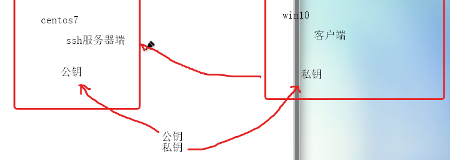
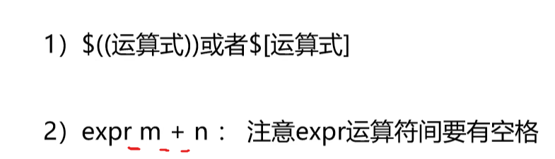

## 软件安装方式

make 程序调用其它编译器编译，会查看Makefile文件

config、 configuer 用来检测有没有编译器、检测是否已经安装相关软件依赖、会检测操作环境是否符合安装、检测结果生成Makefile文件

软件通常打包成tarball文件    先打包后压缩    


### 源码安装

获取源码文件：放在/usr/local目录下——检测操作环境：——创建Makefile文件：——编译：——安装：

示例：


### rpm安装

dpkg ——apt-get安装

优点：1）文件已编译二进制   2）包含软件版本信息  3）有检测系统环境（版本，容量）的脚本软件    4）RPM管理方式使用数据库记录（/var/lib/rpm)便于升级删除、查询、验证


--nodeps    #强制安装

-q   #查询是否安装

-qa #查询所有安装软件

-e   #删除软件  常常有依赖   --nodeps  强制删除

prm --rebuilddb #重建数据库


### yum安装

软件名称、二进制文件、依赖软件、等放在数据库服务器


更换yum源文件：

1、找到/etc/yum.repos.d并备份

2、 下载CnetOS-Base.repo到/etc/yum.repos.d

3、运行yummakecache生成缓存


本地yum源在镜像上


install 软件名

update 软件名

remove  软件名称

本机RPM数据库记录本机已将安装应用


vmware-hgfsclient  #查看是否开启共享

在/mnt创建临时挂载点

vmhgfs -fuse .host:/   /mnt/share


### 源码安装示例：

* 先解压：


* ./configuer   --prefix=/usr/local/apr   #检测环境并安装


缺少GCC编译器：


安装


### 配置java环境

1. 将文件放置在/usr/local文件夹并解压


2. 查看原来的java版本并删除

```shell
rpm -qa | grep java #查看安装的java包
rpm -e --nodeps #强制卸载
```


3. 查看解压后的文件查找jre和jdk


4. 添加java环境变量 /etc/profile 文件


source profile   #使配置文件内容立马生效

再次使用java -version查看


### 更换yum源：

1. 文件替换


1.备份源文件

2.重命名源文件

重建yum缓存：yum  makecache

清空索引缓存： yum clear all


### 更换本地yum源

缺少/mnt/cdrom/创建


### mysql 安装


1. 更换密钥

rpm --import https://repo.mysql.com/RPM-GPG-KEY-mysql-2022

2. 使用yum安装软件包


3. 安装服可以对外提供服务


###yum安装iptables-services


### SSH


1.  22端口有危险建议更改

2. root权限太大

3. 空密码  连接禁止

4. 禁止使用密码连接

5. 对连接IP限制 接口限制只能在防火墙上限制

6. 日志


1. systemctl status sshd   #查看ssh状态

2. 防火墙允许端口通过

加固：

* 修改配置文件 /etc/ssh/sshd_config

生成密钥：ssh-keygen -t rsa 




6、日志安全


### MySQL


#### MySQL外联设置


* 接口绑定配置，修改防火墙的策略   ==防火墙放行==
* 验证用户名——用户是否存在于数据库服务器中、有没有远程连接权限  ==用户授权==
* 密码是否正确

#### 用户授权

SQL服务器设置


```sql
grant  权限  on 库名.表名  to  用户名 @ 主机名 identified by 'password';
grant all privileges on 

flush privileges #刷新授权信息

select user,host from mysql.user
```


1、接口      2、端口       3、日志          4、启用用户（降权运行服务）

ps -ef  | grep mysql


mysql -u username -ppassword -hhostname -P port


更改权限：


```sql
grant all privileges on *.* to 'wjp'@'%' identified by 'Admin@123';
```


修改端口：/etc/my.cnf   #配置文件


## 防火墙


每一条链由多条规则构成


链上由多条规则组成


iptables命令：


选项、链名、类型必须大写


-A 追加规则

iptabls -L  #查看链查看配置


2、选项

 -A #追加  -I# 行首添加规则   -L #查看规则   -S列出所有规则  

-D< <CHAIN>> N 删除规则     -F  -Z  清空规则   -P设置链的默认策略   -R #修改  N

--line  -number  #查看时为规则添加序号

4、规则


5、控制类型


丢弃无回应，拒绝有回应

service iptables save #保存防火墙配置，保存后重启

防火墙构成、链表、规则、

```sh
#配置好yum源以后安装iptables-service
# yum install -y iptables-services
#停止firewalld
# systemctl stop firewalld
#禁止firewalld自动启动
# systemctl disable firewalld
#启动iptables
# systemctl start iptables
#将iptables设置为开机自动启动，以后即可通过iptables-service控制iptables服务
# systemctl enable iptables

#查看帮助
iptables -h
man iptables


列出iptables规则
iptables -L -n
列出iptables规则并显示规则编号
iptables -L -n --line-numbers


列出iptables nat表规则（默认是filter表）
iptables -L -n -t nat


清除默认规则（注意默认是filter表，如果对nat表操作要加-t nat）
#清楚所有规则
iptables -F 


#重启iptables发现规则依然存在，因为没有保存
systemctl restart firewalld.service


#保存配置
service iptables save


#禁止ssh登陆（如果服务器在机房，一定要小心）
iptables -A INPUT -p tcp --dport 22 -j DROP
#删除规则
iptables -D INPUT -p tcp --dport 22 -j DROP


-A, --append chain  追加到规则的最后一条
-D, --delete chain [rulenum]  Delete rule rulenum (1 = first) from chain
-I, --insert chain [rulenum]  Insert in chain as rulenum (default 1=first) 添加到规则的第一条
-p, --proto  proto  protocol: by number or name, eg. 'tcp',常用协议有tcp、udp、icmp、all
-j, --jump target 常见的行为有ACCEPT、DROP和REJECT三种，但一般不用REJECT，会带来安全隐患


注意：INPUT和DROP这样的关键字需要大写


#禁止192.168.33.0网段从eth0网卡接入
iptables -A INPUT -p tcp -i eth0 -s 192.168.33.0 -j DROP
iptables -A INPUT -p tcp --dport 22 -i eth0 -s 192.168.33.61  -j ACCEPT


#禁止ip地址非192.168.10.10的所有类型数据接入
iptables -A INPUT ! -s 192.168.10.10 -j DROP


#禁止ip地址非192.168.10.10的ping请求
iptables -I INPUT -p icmp --icmp-type 8 -s 192.168.50.100 -j DROP


#扩展匹配：1.隐式扩展 2.显示扩展
#隐式扩展
-p tcp
--sport PORT 源端口
--dport PORT 目标端口


#显示扩展：使用额外的匹配规则
-m EXTENSTION --SUB-OPT
-p tcp --dport 22 与 -p tcp -m tcp --dport 22功能相同


state：状态扩展，接口ip_contrack追踪会话状态
NEW：新的连接请求
ESTABLISHED：已建立的连接请求
INVALID：非法连接
RELATED：相关联的连接


#匹配端口范围
iptables -I INPUT -p tcp --dport 22:80 -j DROP


#匹配多个端口
iptables -I INPUT -p tcp -m multiport --dport 22,80,3306 -j ACCEPT


#不允许源端口为80的数据流出
iptables -I OUTPUT -p tcp --sport 80 -j DROP


#修改第一条规则为不允许源IP为192.168.0.1的数据流出
范例 iptables -R INPUT 1 -s 192.168.0.1 -j DROP
说明：1是位置，规则被取代后并不会改变顺序。

# 默认入向全部DROP
iptables -P INPUT DROP	
```


## shell


通过#！ 指定调用环境  /bin/sh   /bin/bash


sh 1.sh  #需要管理员程序，作为解释器参数


1. 注意shell结构

```shell
#! /bin/bash    #必有
#执行方式
#1.作为可执行程序  chmod a+x 1.sh  相对路径  绝对路径
#2.作为解释器参数   sh ./test.sh

```


2. 注意变量

* 系统变量 $PATH  、 USER
* 

```shell
#!/bin/bash
A=hello
B=`date`   #使用反引号包含命令
C=${cat /etc/passwd}
echo $A
echo $B

#位置参数变量  echo "0 $n"   #第N个参数
echo "0 $0"   #本条命令
echo "3 $3"   #第三个参数
echo "@ $@"   #全部变量
echo "* $*"  #全部变量
echo "# $#"  #参数个数

#预定义变量
echo "$ $$" #本进程进程号
echo "! $!"  #后台运行进程

echo "? $?"  #最后一次执行命令返回状态 0执行成功


./3.sh  &  #后台运行


A=$[1+3]
B=$((2+3))
C= $(wxpr 3 + 3)


```




3. 逻辑判断


数值比较


```shell
#!/bin/bash

if (( $1 == 1 ))
 then 
   echo hello
fi

if [ $2 -gt 10 ]
 then 
    echo 1
elif [ $2 -lt 10 ]
  then 
    echo 0
else 
   echo $2
fi

```

```shell
#!/bin/bash
A=/home/wjp
if [ -d $A ]
 then ls $A
else mkdir -p $A
fi
```


```shell
```


运行权限降权运行


# K

init

vim

用户内容文件

shell结构

循环


