## 数据库

### 发展阶段

1. 人工管理阶段  

* 数据面向应用程序
* 数据不保存
* 数据不能共享
* 不具备数据独立性

2. 文件系统管理

* 由文件系统管理数据
* 数据可以长期保存
* 数据是面向应用的q
* 数据共享——具备一定共享性，冗余存储q
* 数据独立性——具备设备独立性，不具有数据独立性q

3. 数据库系统管理

* 共享性高
* 冗余度小
* 具有高度的物理独立性和逻辑独立性

### 特点

* 结构化
* 共享性高，冗余低
* 有安全性和完整性的保证
* 数据高度独立性
* 数据由DBMS管理
* 利于使用便于拓展

### 概念

数据：现实世界现象的表示

信息： 数据是信息的载体

数据库（DB）：数据集合

数据库管理系统（DBMS）：统一管理数据库的软件

数据库管理人员（DBA）：

数据库系统（DBS）

主：

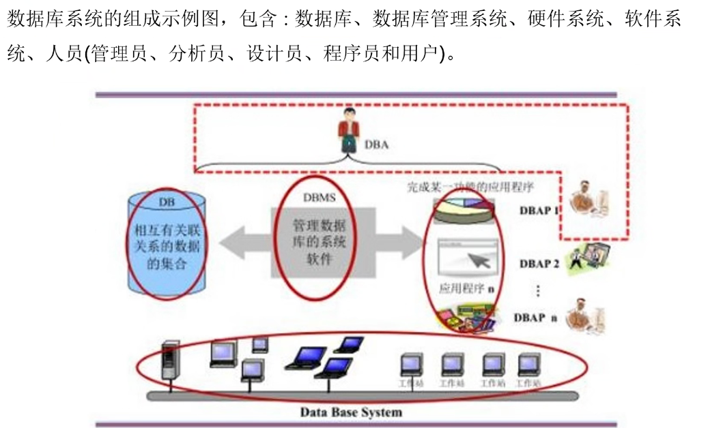

* 表：用来存储数据，以行列的方式组织
* 记录：记录是指表中的一行
* 字段： 表中的一列
* 关系： 二维表
* 视图： 表是真实存在的，视图是虚拟表，用于限制用户可以看到和修改的数据量，简化数据表达
* 索引：建立在表上的单独的逻辑结构
* 存储过程：是一个编译过的SQL程序


1、概念模型：E-R图 （实体：方框表示、属性：椭圆表示 、联系：菱形 ）

2、DBMS支持的数据模型：逻辑数据模型

3、物理模型：

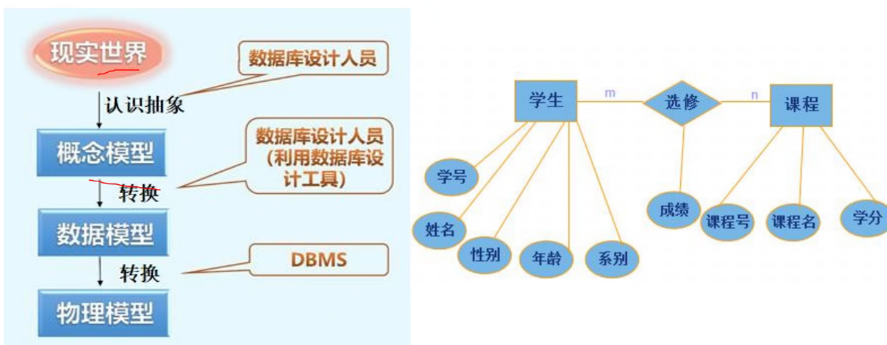

逻辑数据模型用来组织数据结构：

1. 层次模型 （用树形结构组织数据）
2. 网状模型  （用图型结构组织数据）
3. 关系模型   （用简单二维表结构组织数据）

逻辑数据模型三大组成要素：

* 数据结构： 描述组成对象及对象间的联系
* 数据操作：索引、更新、插入
* 完整性约束： 实体完整性（保护实体）、参照完整性（与实体联系）、用户定义的完整性（要求）、


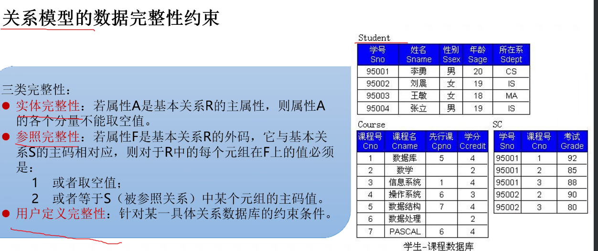

实体完整性和参照完整性可降低冗余和错误率

实体完整性。

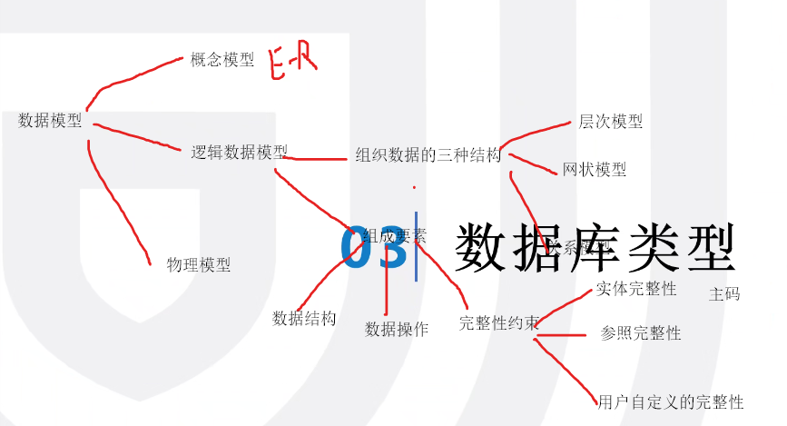

### 类型

1. 关系型数据库 

特点：

* 容易理解
* 方便使用
* 易于维护
* 高并发性能不够q
* 海量数据读写效率低q

常用数据库：

* Oracle：1521
* SQL Server：1433   （只能windows）
* MySQL：3306
* postgreSQL：5432 (有大量存储过程，其余都先现编)
* DB2 ：5000 （较小）
* Access    （文件）


2. 非关系型数据库（NoSQL）

以键值对存储：结构不固定

特点：

* 部署简单
* 语言不固定
* 数据结构复杂

MOngoDB、      == Redis：6379 ==

区分：1、组织结构  2、是否可以执行SQL


### Oracle ：1521

oreacle实例：保存在内存中的数据   SYS用户

数据库管理系统：保存在硬盘中         SYSTEM用户

优点：移植性好、方便、功能强、

### SQL Server ： 1433

默认用户名：sa 管理员用户

内置系统数据库：

* masters数据库   数据库记录 SQL Server 系统的所有系统级信息
* model数据库      创建数据库的模板数据库
* tempdb数据库    全局资源，所用户使用，保存临时数据和存储属性   （xp-cmdshell可以执行dos 命令）
* msdb数据库       记录对数据库的操作和报警信息


### PostgreSQL  ：5432

默认用户：postgres

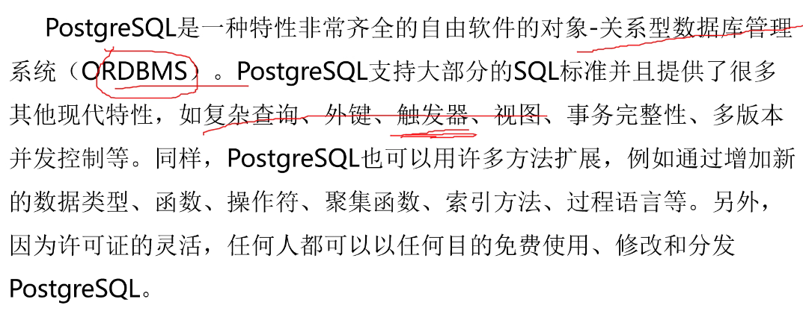

* template0
* template1
* postgres 核心库 保存用户信息

### MySQL ：3306

默认用户：root

* information_schema  ：保存数据库中所有的数据库、表、

* mysql    ：权限参数、用户名信息、

* performance_schema     ：存储关于MySQL的配置信息

* sys


###  web应用软件架构

LAMP：指一组通常一起使用，运行动态网站或者服务器的自由软件

​	L：操作系统

​	A：中间件

​	M：数据库管理系统 MySQL

​	P： php python脚本软件


### 数据库在web中风险

#### 风险

* 弱密码
* 拖库   SQL注入

接口等、

#### 防护

* 密码管理
* 端口安全 修改默认端口
* 数据传输安全   加密
* 日志记录

### 安全配置

1. 补丁安装
2. 账号密码


3. 网络与服务端口修改访问端口绑定

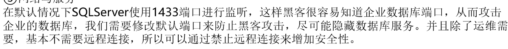

4. 日志审核
5. 服务降权——满足最小服务权限
6. 管理存储过程

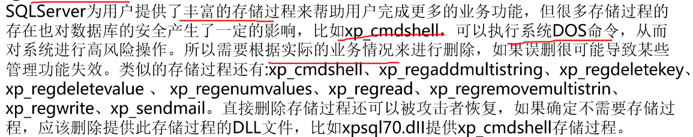

```sql
grant all priviledges on *.* to 'root'@'%' identified by 'Admin@123' with grant option

```


### SQL 语言功能

* DDL：数据定义语言
* DCL ：数据控制语言
* DML：数据操作语言、数据更新语言
* DQL：数据查询语言


* sys    测试用的库

* information_schema  ：保存数据库中所有的数据库、表、

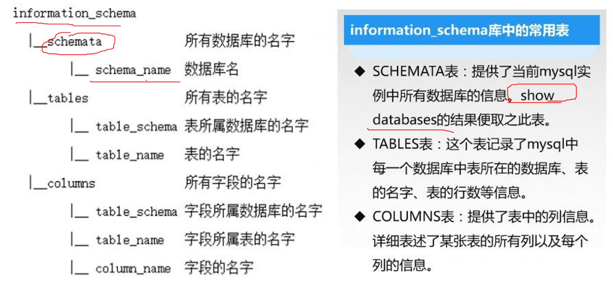

* mysql    ：权限相关信息、用户名信息、
* performance_schema     ：存储关于MySQL的配置信息


#### 注释方式

```sql
#单行注释
-- 单行注释（注意中间要带有一个空格才可以生效）
/*多行注释*/      #多行注释
/*!版本号 SQL */  #内联注释
#5.7 》！5.6版本号  SQL执行
#5.7《！ 5.8 作为注释
#5.7 ！  无版本   作注释
```

### DDL

```sql
create    #作用于数据库
alter    #作用于基本表和视图
drop    #作用于数据库

```

### DQL

```sql
select   #作用于基本表和视图
```

### DML

```sql
Insert   #作用于基本表和视图  on
Update   #作用于基本表和视图  on
Delete   #作用于基本表和视图  on
```

### DCL

```sql
Grant  
Revoke   
Commit    
```

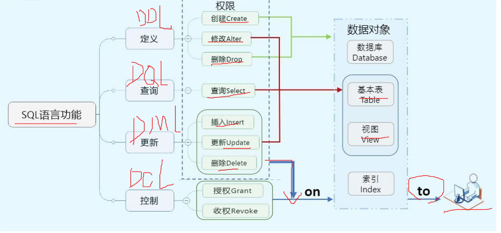

```sql
show databases;   #查看所有的数据库

show character set #查看数据库字符集

show create database [datavaseName]; #查看数据库结构

alter database [databaseName] character set [characterName]   #修改数据库的字符集

create database [databaseName]  #创建新的数据库

create database [databaseName] default charater set [characterName]   #创建新的数据库并指定字符集

use [databaseName]  #选中数据库

drop [databaseName]  #删除数据库


```

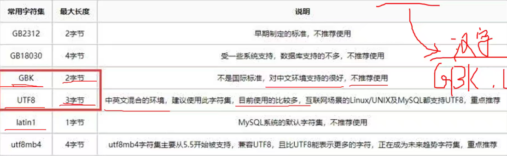

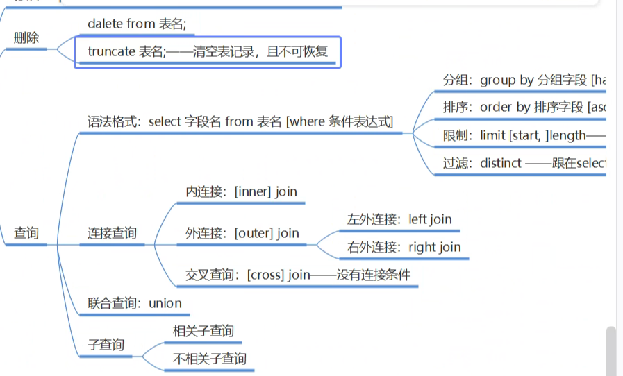

### 数据类型


#### 整数型   缺少其他数据库

* tinyint  1B
* smallint   2B
* mediuint   3B
* int  4B 
* bigint   8B

#### 小数类型

1. 精确小数类型

* float    4B
* double  8B

1. 

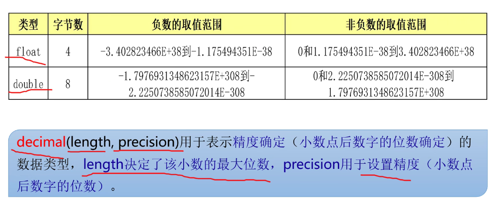

```sql
decimal (length,,precision) #表示精度
```

#### 字符类型

1. 定长字符串类型

* char

1. 变长字符串类型

* varchar
* text

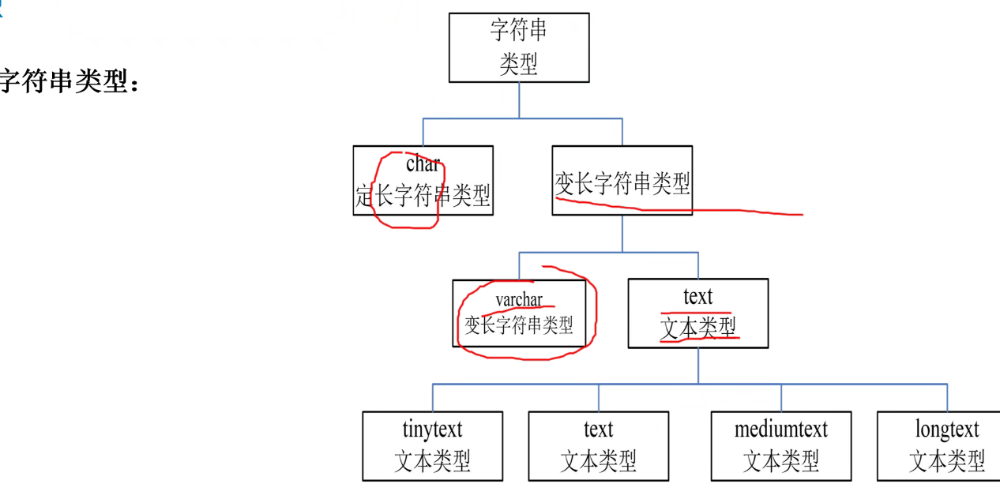

#### 日期时间类型

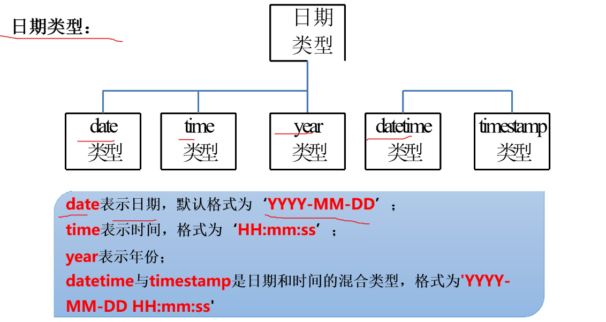

datetime时间范围大于timestamp

### 创建表

```sql
create table table_name(
    colum1 colum1_type [约束条件],
    
[表级约束条件],
[表级约束条件]
)其他选项


```

### 约束

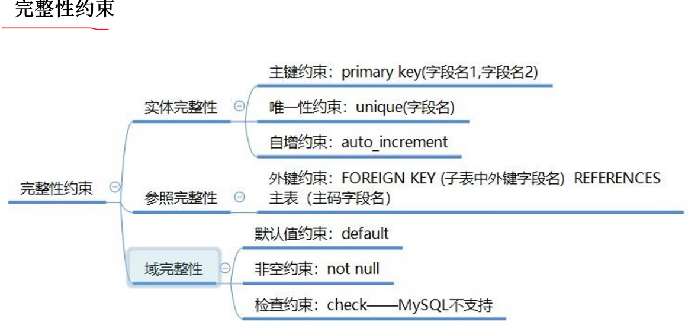

1. 实体完整性

* 主键约束（primary key)：唯一、非空     ###可表级可列级
* 唯一性约束（unique）：唯一没有重复值   #只能写在表级约束
* 自增约束（auto_increment)：值自动加一  ##只能列级约束

2. 参照完整性

* 外键约束 foreign key (子表中外键字段名) reference 主表（主表字段名）          #只能写在表级约束

3. 域完整性

* 默认约束 defalut                             ##只能列级约束
* 非空约束 not null    null是空值       ##只能列级约束
* 检查约束  check——MySQL不支持（对数值范围的约束）


```sql
show tables #查看数据库中所有表
describe  #查看


#只复制表数据不复制表结构
create table 新表 like 源表  
#表名表结构都复制
create table 新表名 select * from 源表 


#删除表字段
alter table 表名 drop 字段
#添加新字段
alter table 表名 add 新字段名 类型 [约束] [first|after 就字段名]
#修改字段名
alter table 表名 change 旧字段名 新字段名 类型
#修改字段名
alter table 表名 modify 字段名 新类型

#修改约束条件
alter table 表名 add [constraint 约束名] 约束类型 (字段名)

#删除约束名称 
alter table 表名 drop primary key
alter table 表名 drop foreign key 约束名
drop index 索引名 on table_name

#修改表名
rename table  旧表名 to 新表名
alter table 旧表名 rename 新表名

#删除表
drop table table_name


```


### 数据更新操作

```sql
# 1、
# 2、值列表顺序
# 3、插入数据类型要一致
# 4、约束条件 非空、是否存在
# 5、插入日期时要用、字符串 ——————单引号包裹
# 6、多条记录values，每条逗号隔开
# 7、检查约束-4、


insert into 表名 [(字段列表)] value (值列表) #

#直接覆盖
replace into 表名 [(字段列表)] value (值列表) 

#插入多条记录
insert into 表名 [(字段列表)] values
(值列表1),
(值列表2);


#修改数据
update 表名
set 字段名1=值1,字段名2=值2 [where 条件表达式] ;
#要遵从约束条件


delete from 表名 [where 条件表达式]


```


### 查询语句

```sql
select [all|distinct] <目标列表达式>
                     [,<目标列表达式>]
from <表名或者视图名>[,<表名或者视图名>]
[where <条件表达式>]
[group by <列名> [having <条件表达式> ]]
[order by <列名> [asc|desc]]


as   #对查询名进行重命名
distinct #清除重复的行
limit [start,] length; #对返回行的数量进行限制 计数从0开始
limit length offset start ;#offset后面开始位置

select sage+2, sname from student;
order by <列名&列号> 默认asc
#多列排序，先按第一列排，当第一列出现相同再按第二列排序，以此类推

```

可以使用算数运算符对数据列进行加减乘除、不影响源表数据

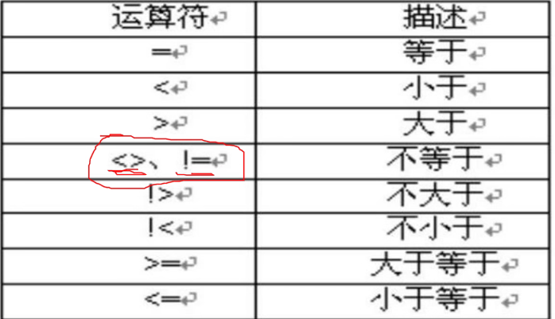


范围查询：

```sql
expression [not] between expression and expression2
between 包含边界值、 not between 不包含边界值

expression in (value1,vlaue2)  #在指定数据范围内

is null  #有空值
is not null #没有空值


#模糊查询  使用like进行字符串匹配   %不确定字符数  _确定字符数

select * from student where sname like '王%';
select * from teacher where tname like '刘_';


```


### 聚合函数

```sql
#计数 *计算包含空，其余都不包含空
select count(sage) from student where ssex='男';

select AVG(sage) from student where ssex='男'

```

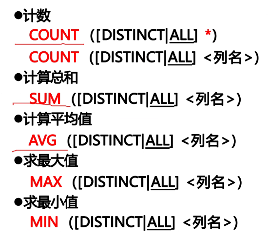

* count * 计算所有的值包含空值
* 聚合函数不能用在where中
* 除count* 以外其它函数都不计算空值
* 都可联合使用出现在一个sql中
* 都返回的都是单一的值

### 条件转换函数

```sql
#简单case将目标值转换成想要的值
case 列名
when 值1
	then 转换值1
when 值2
	then 转换值1
else 转换值2
end
#示例
select sno,sname,case sage
when 25 then '成年'
when 23 then '成年'
when 16 then '未成年'
else '未知'
end as '是否成年' 
from student;


#搜索case 
select sno,cno,case 
when score>=80 and score<=100 then '优秀'
when score>=70 and score<80 then '良好'
when score>=60 and score<70 then '及格'
when score>=0 and score <60 then '不及格'
else '错误值' end
from score;


```

### 分类汇总

```sql
#group by
select 列或者统计表达式 
from表名
group by <分组依据>
[having 组筛选条件]  #不能单独使用必须和group by 一起


select cno,avg(score) from score group by cno;

select cno,avg(score) from score group by cno;

select ssex,sum(sage),avg(sage) from student group by ssex;

select cno,avg(score) from score group by cno having avg(score)>60;  


#group_concat(sno) #将结合中的字符串连接起来
#concat()函数 将字符串连接起来

select group_concat('123','456','789'),concat('123','456','789');

#group_concat()函数还可以按照分组字段，将另一个字段的值（null）除外使用逗号连接起来，而concat没有这样的功能
select tno,count(cno),group_concat(cname) from course GROUP BY tno;

select	from	where	group by	having	order by
```


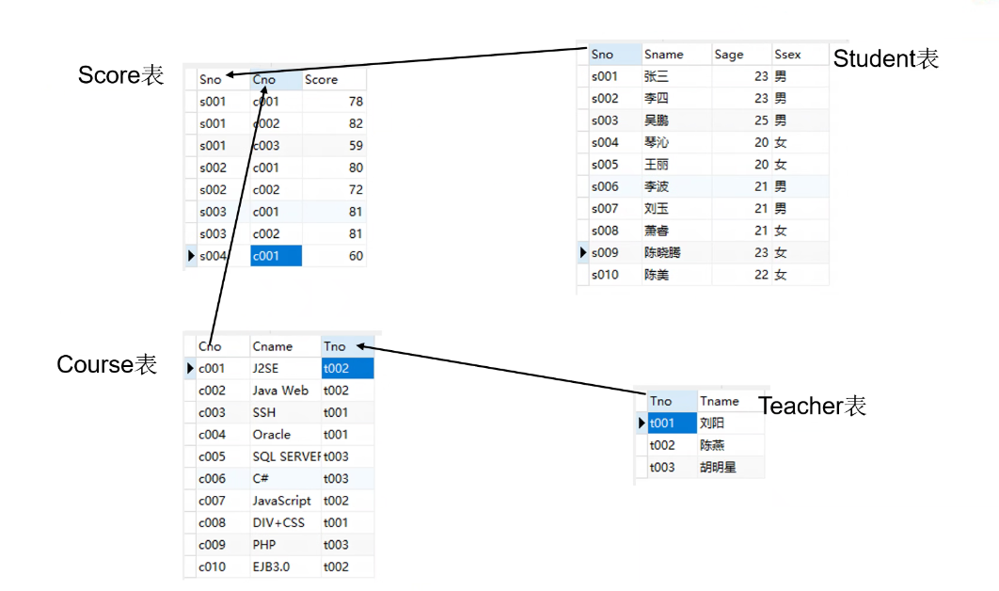

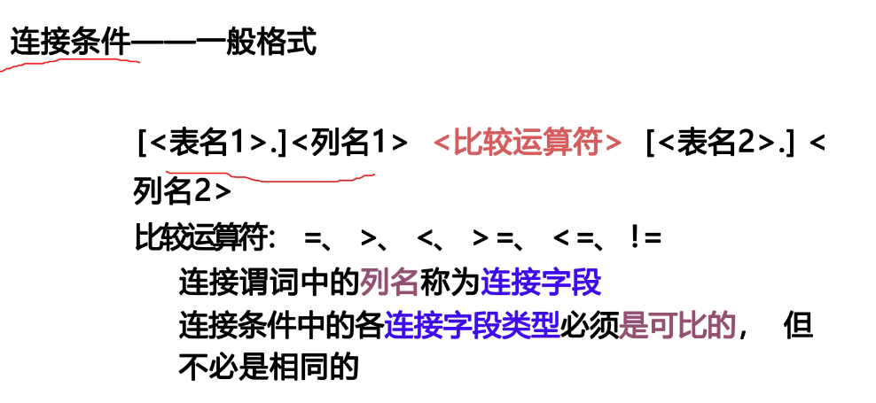

```sql
select * from 表名1 join 表名2 on where
select * from
```

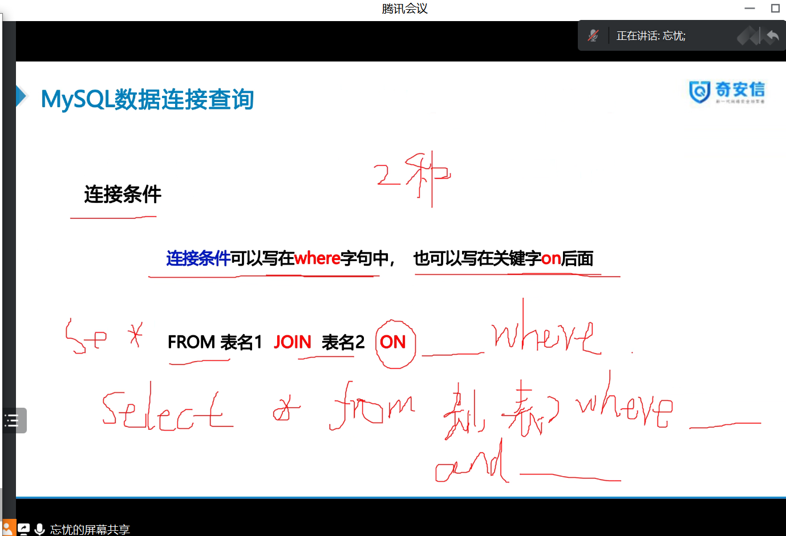

### 连接查询

#### 内连接——满足条件

```sql
#格式1
select 列表名 from 表1 [inner].join 表2 on 连接条件

#格式2
select 列表名 from 表1,表2 where 连接条件

###注意事项###
1、表名中引用同名属性时，必须加表名前缀
2、

#示例
#查询学生的姓名及选修的课号和成绩
select sname,cno,score 
from student as st, score as sc
where st.sno=sc.sno;

#自连接，自己根自己连接
select sno,sname from student as st1 join student as st2 on st1.sno=st2.sno

```


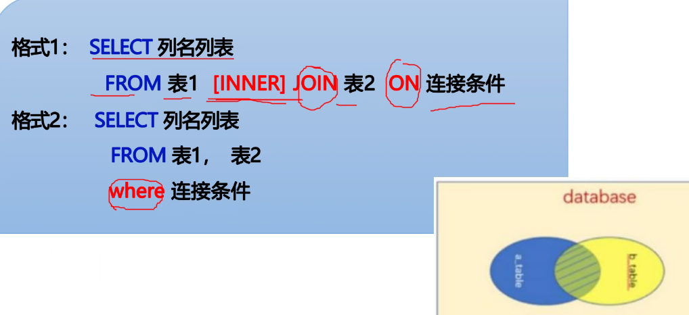

#### 外连接——尽管不满足也展示

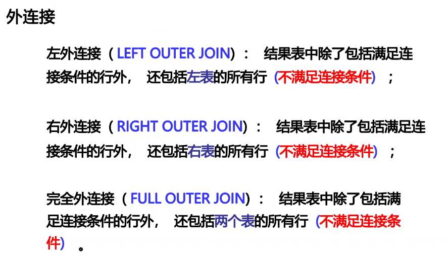

* 左外连接

* 右外连接

* 完全外连接

```sql
#外连接不能使用where
select 列表名
from 表A left/right/full(可省略) join 表B
on 表A.字段=表B.字段


```


#### 交叉连接

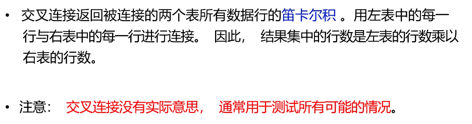

A 10   B 5       10*5-50   


连接查询展示的水平连接

### 联合查询

```sql
select 列项目 from 表1 [where 条件1] 
union [all]
select 列项目 from 表2 [where 条件2] 
union [all]
select 列项目 from 表3 [where 条件3] 
```

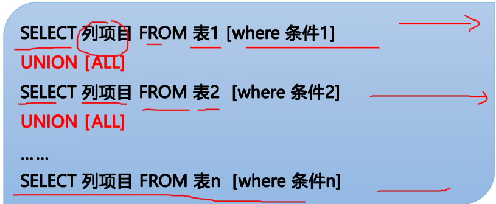


注意事项：

* 所有查询语句中的列数和列的顺序必须相同
* 查询列的数据类型必须兼容
* all表示表示合并的结果包含所有行 ==不去除重复行==

### 嵌套


* 要注意内嵌的查询返回的结果是否有多个单个可以用运算符
* 子查询不能使用 order by
* 子查询要使用括号包裹

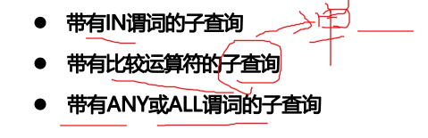

使用比较运算符条件

* 返回值单一
* 不是单值要和any和all配合一起使用

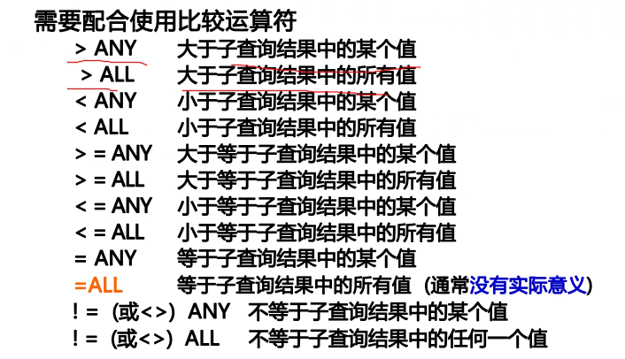


