## 函数与变量

DQL中select 作用：1、数据查询   2、定义变量     3、调用函数

### 系统变量

由系统定义和维护，变量名前加“@@”

* 会话系统变量      （生存周期：一个会话）
* 全局系统变量      （生存周期：整个系统生存周期）
* 静态变量属于特殊的全局系统变量


show global variable   #查看系统变量

show session variable  #查看所有会话变量及系统变量


### 用户自定义变量

由用户定义和使用

* 用户会话变量（以“@”开头）
* 局部变量（不以@开头）

局部变量一般使用在存储过程中

区别： 1、生存周期   2、用户变量前有@   3、declare定义局部变量  4、用户变量不用定义类型 ，局部变量要定义类型

```sql
##############用户自定义变量####################
#1、使用set命令定义变量同时赋值
set @变量名1 = 表达式, @变量2 = 表达式2  ;
set @mysqo = "MySQL is "
select @mysqo;  #查看变量


#2、使用select命令定义变量的同时赋值
select @变量名1 := 表达式1;
select 表达2,@student_count into @变量1,@变量2

#示例：
set @student_count = (select count(sno) from student );

select @student_count;
#示例2：
select @student_count:=(select count(sno) from student );
#示例3：
select count(sno) into @student_count from student ;


#####################局部变量###################
/*局部变量使用declare定义 
*/
```

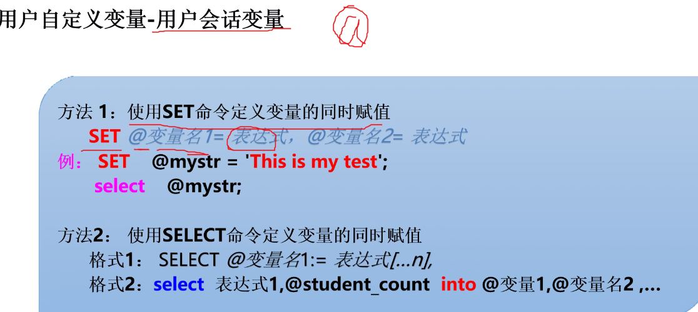

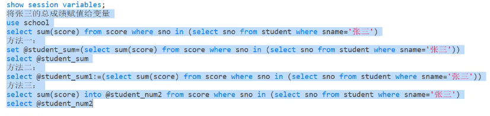

区别：

* 用户会话变量名以“@”开头，而局部变量名前无“@”
* 用户会话变量的作用范围与生存周期大于局部变量
* 

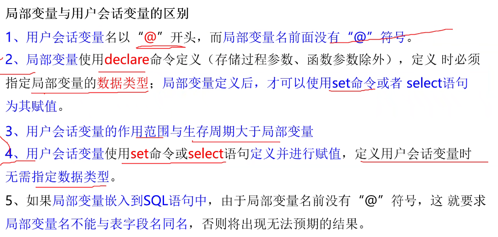


### 函数

```sql
ABS(X)   #返回绝对值
pound(X),(X,D)  #返回离X最近的小数（小数点后保留y位）

floor() #返回小于等于该值得最大整数

ceil(X)  #大于等于该值得最小整数

pow()   #返回一个数字的值到另一个数字的幂、

rand()  #返回一个随机数


select concat('java','程序','设计');

####字符串裁剪函数####

ltrim(X)  #用于去掉字符串X开头的所有空格字符
rtrim(X)  #用于去掉字符串X结尾的所有空格字符
trim(X)  #用于去掉字符串X开头及结尾的所有空格字符，不会截取中间字符串

left(X,length)  #从左边开始裁剪n个字符
right(X,length) #从右边开始裁剪n个字符

upper(X)   #将所有字母转换成大写字母
lower(X)   #将所有字母转换成小写字母

substr(X,start,length)    #start从1开始计数 用来截取从start开始的 n 个字符串
substring(X,start,length)   #start从1开始计数 用来截取从start开始的 n 个字符串
mid(X,start,length)   #start从1开始计数 用来截取从start开始的 n 个字符串

replace(X1,X2,X3)   #使用X1中X2字符串替换成X3;


strcmp(X1,X2) #用于比较两个字符串X1和X2是对ASSIC码进行比较,从头开始一个一个字符比较
#X1>X2 返回  1
#X1=X2 返回  0
#X1<X2 返回 -1

reverse(X) #将整个字符串逆序

format(X,n)  #字符串格式化，格式化为整数或者浮点小数


```


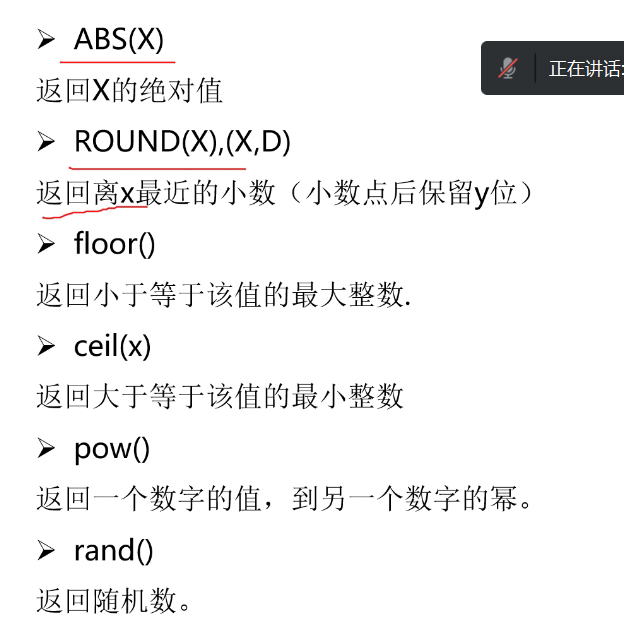

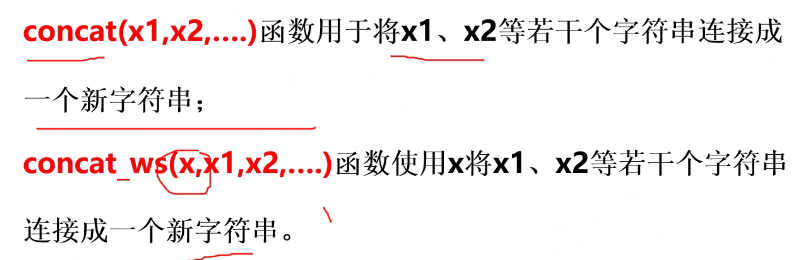

#### 日期函数

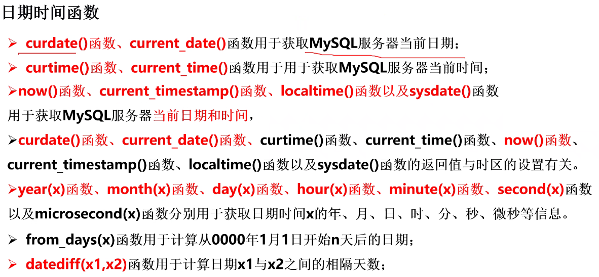

函数后面+0可以显示纯数字


#### 系统信息函数

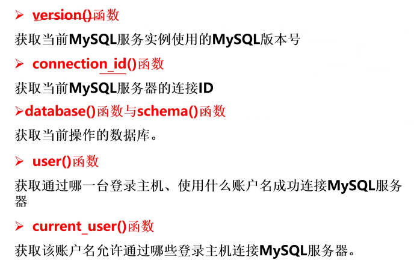

#### 加密函数

* 不可逆的加密函数

password(X) 对X进行加密，默认返回41位的加密字符串

md5(X) 对X进行加密，默认返回32位的加密字符串

* 可逆加密函数

encode(X,key) 、decode(password,key)

aes_encrypt(x,key)、aes_decrypt(password,key)


hex(X)与unhex(X) #字符串与十六进制转换

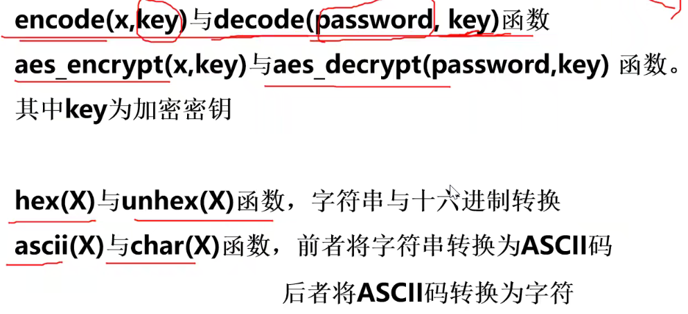

### DCL

* grant       授权
* revoke    收权
* commit       提交事务
* rollback      回滚事务


用户：用户名+主机名（IP）

mysql 数据库

* user表   权限表，记录允许连接到服务器的账户信息，权限是全局级
* db表    存储了用户对某个数据库的操作权限
* host表      存储了某个主机对数据库的操作权限
* tables_pri      对表的操作权限
* colums_pri      对列的操作权限
* procs_pri      对存储过程和存储函数的权限

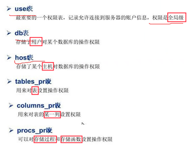


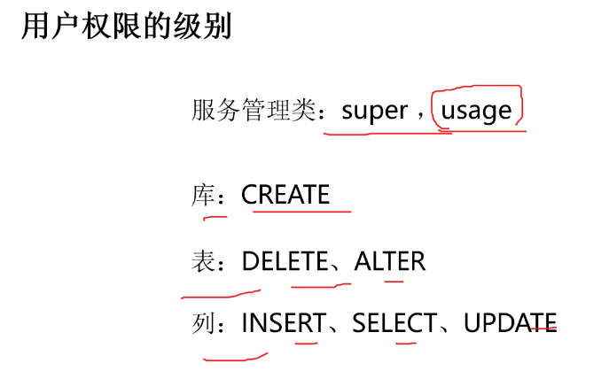

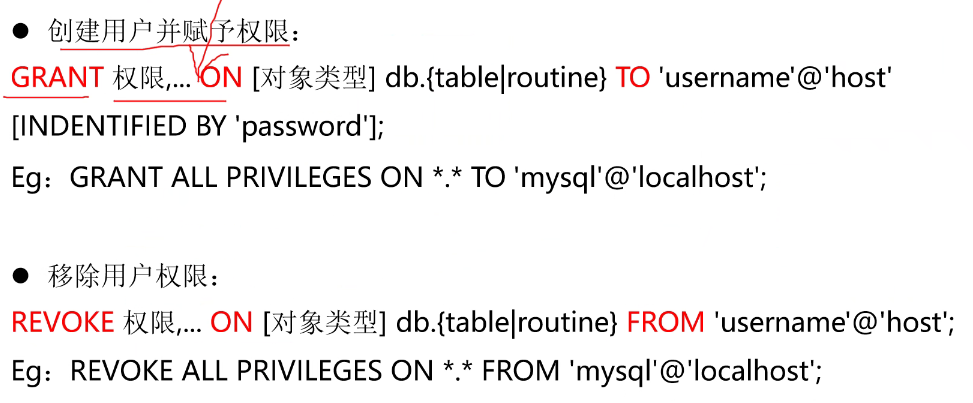

​         with grant option  #允许将自己权限授予其他人

show  grant for  用户标识：用户名+IP

flush privileges;    #刷新权限

```sql
grant select,insert on school.* to 'xiaoming'@'localhost' identified by 'Admin@@123'
```

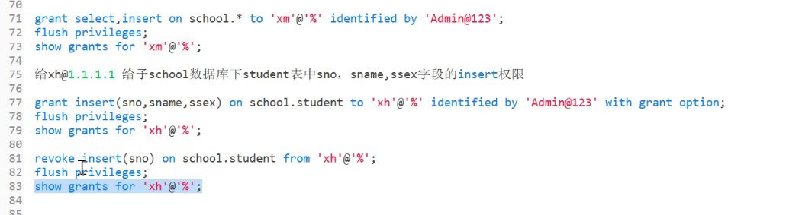

```sql
#创建用户
create user 'username'@'host' [identified by 'psswoord'];


#重命名用户
rename user old_name to new_name;

#更改账户密码
set password for 'root'@ 'localhost' =password('新密码');

#删除用户
drop user '用户名'@'主机名'

delete from mysql.user where user='用户名' and host='主机名';


```

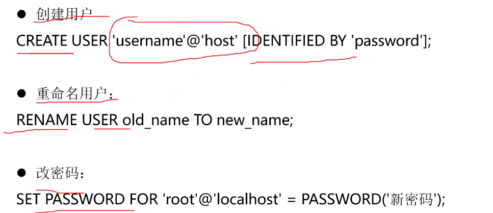

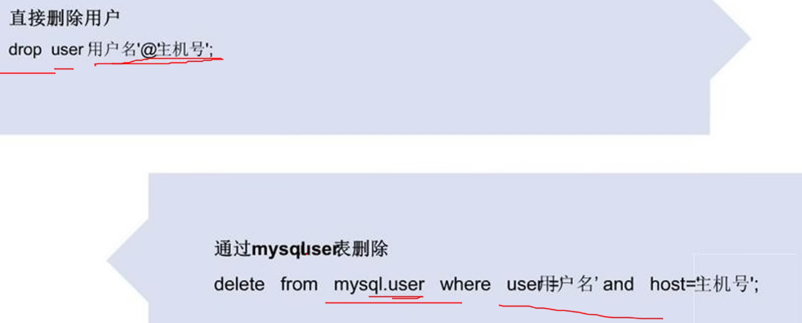


### 备份与恢复

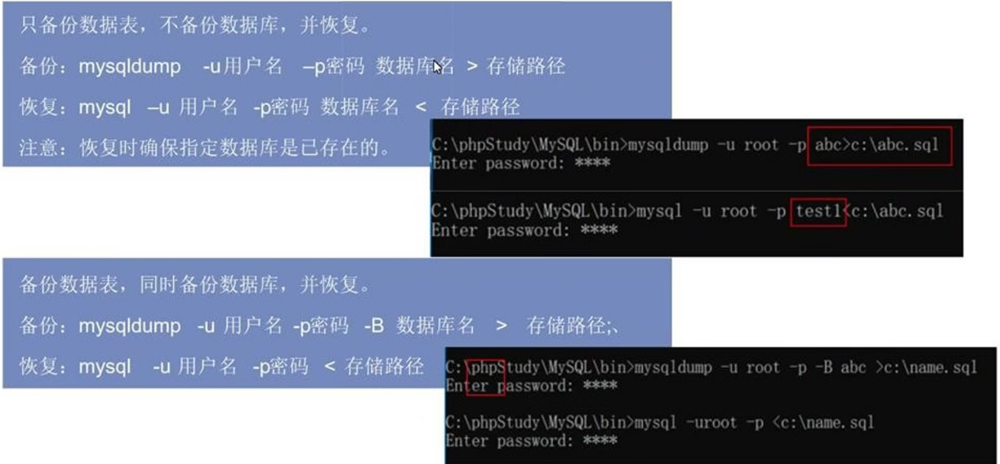

```sql
#备份数据库
mysqldump -u用户名 -p密码 数据库名 > 存储路径
#恢复数据库
mysql -u用户名 -p密码 数据库名 < 存储路径
#### 恢复时要确保数据库已经存在


#备份结构和数据
mysqldump -u用户名 -p密码 -B 数据库名 > 存储路径
#恢复
mysql -u用户名 -p密码 < 存储路径

```


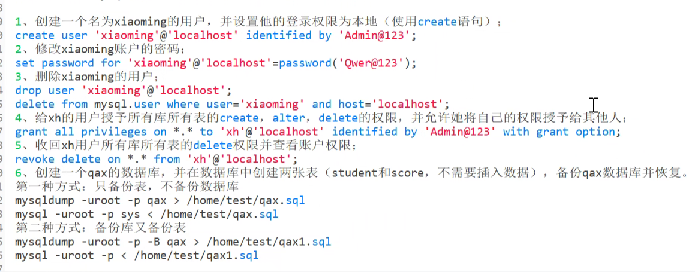

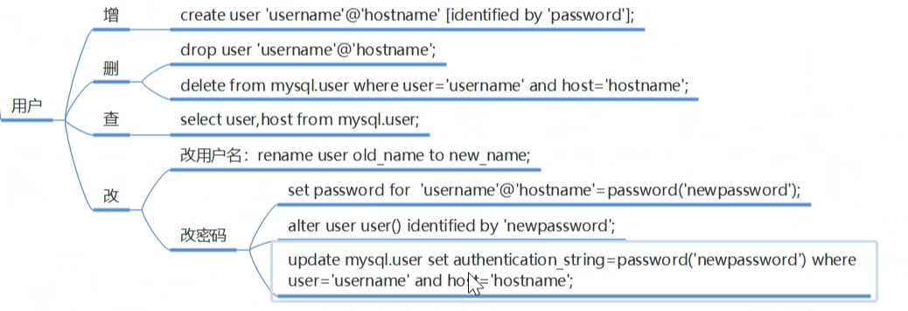
