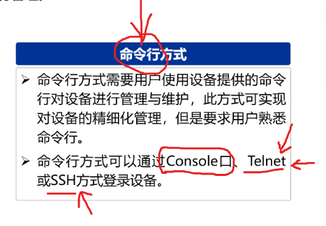
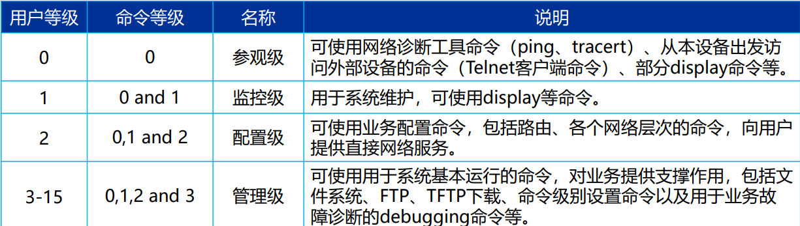
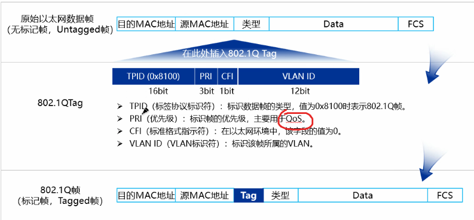
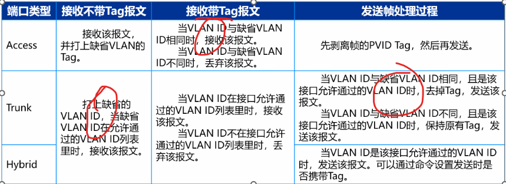
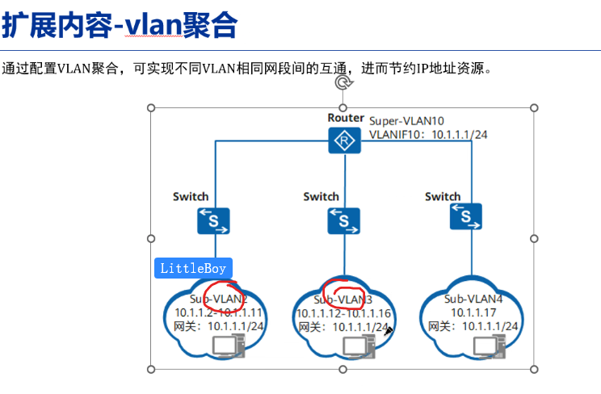
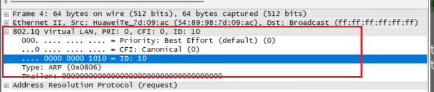
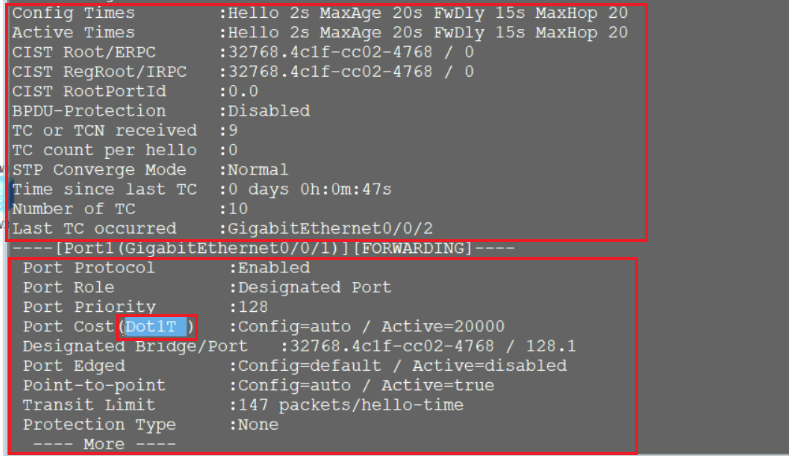
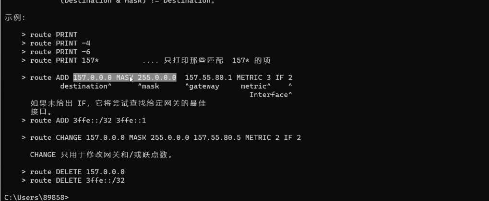
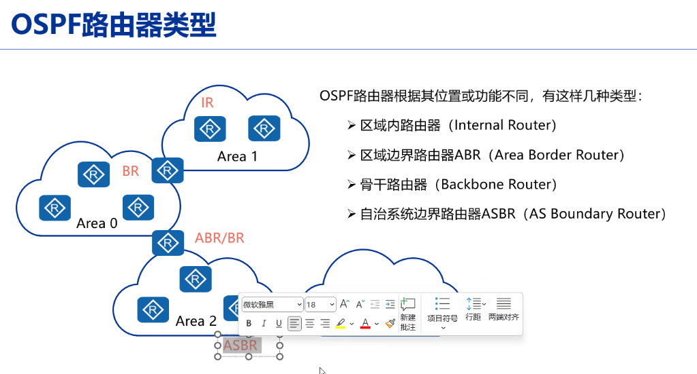

# 一、网络基础设备


lacp 32768：交换机and接口

生成树端口优先级 0-240 默认128

桥id 65536

## 1、VRP

VRP是华为公司数据通信产品的通用操作系统平台， 作为华为公司从低端到核心的全系列路由器、以太网 交换机、业务网关等产品的软件核心引擎。

VRP提供以下功能： 

* 实现统一的用户界面和管理界面 
* 实现控制平面功能，并定义转发平面接口规范 
* 实现各产品转发平面与VRP控制平面之间的交互 
* 屏蔽各产品链路层对于网络层的差异

### （1）文件系统：

1）系统文件(cc)

2）配置文件(cfg、zip、bat)

3）补丁文件(pat)

4）PAF文件(bin)：截取产品资源的占用和功能特性

### （2）存储设备

1）SD Card

2）Flash

3）USB

4）SDRAM

5）NVRAM

### （3）设备管理

1）Web网管方式（console用户界面）

2）命令行方式（VTY用户界面）



### （4）用户级别：



常用的客户端工具：secureCRT、MobaXtem、xShell(xFTP)

### （5）交换机终端命令：

~~~shell
#用户视图：<>
#系统视图：【】
system-view：系统视图
quit:退出系统视图

###基础命令
display:查询/
	display mac-address verbose/brief
	dis this/dis ip interface brief
	display interface
show
undo  ...（想要撤回的命令）
current
save
~~~

### （6）硬件基础知识：

~~~shell
###硬件基础知识
console线缆：
	RJ45：水晶头、插头
	ETH：
长城防火墙
网线：4条网线用于传输
电模块：转换口，用来转换成网线
网线顺序（568B）：白橙 绿蓝 棕色
为光纤通信提供通道：
	OTN：optical transport network
	SDH：
全双工的要求：1、速率要相同；2、模式相同
勒索病毒最先在教育网里传播
核心-->汇聚-->接入设备
高度单位：U=4.45（三个螺丝口）
pppoe（ethernet & ppp）
tracert 测试路由环路，默认最多到三十多跳
~~~

### （7）FTP配置

~~~shell
###ftp命令
1、输入ftp IP
2、输入用户名
3、binary
4、get 文件名/put 文件名
~~~

## 2、MAC地址

分类：

* 第八位为0是单播，为1是组播，全1是广播

## 3、IP地址

私网地址

* A：10.0.0.0 - 10.255.255.255
* B：172.16 0.0 - 172.31.255.255
* C：192.168.0.0 - 192.168.255.255

特殊地址

* 本地链路地址：169.254.0.0 /24
* 环路：
* 任意地址
* 有限广播地址

# 二、交换技术

## 1、VLAN基础知识

1、vlan标签（IEEE 802.1Q协议）（4个字节的Vlan标签）

1）、字段

* TPID(标签协议标识符)

* PRI(优先级)：

* CFI(标准格式指示符)：

* VLAN ID(VLAN标识符)：

  

2）、VLAN链路类型

* 接入链路（无标记帧）：连接用户主机和交换机
* 干道链路（有标记帧）：连接交换机与交换机或者路由器之间

3）、接口类型

​	Access、trunk、Hybrid




~~~shell
# 一、vlan（1~4094）
a）STP生成树关闭，形成环路，广播风暴
b）mac地址漂移
c）什么是冲突域
d）undo t m
~~~


4）Vlan聚合：同一网段聚合




## 2、vlan实操

### （1）vlan的配置

#### a.基于接口的vlan的配置

~~~shell
###基本操作
1、设置交换机；
2、设置电脑的ip，ping不通
##操作:
1、设置vlan：vlan 10
			or vlan batch 10 20
2、验证：dis vlan
3、进入接口：interface g0/0/1
4、设置接口类型：port link-type access/trunk
5、将接口绑定vlan：port default vlan 10
			or （port trunk allow-pass vlan 10 20）
			（更改trunk接口的PVID：port trunk pvid vlan 10）
5、查看接口的vlan：dis port vlan
6、若ip地址一样，会自己ping自己
7、关闭提示：undo info enable
8、重启：shut/undo shut

！！！！！！！！！！！！！！！！！！！！做事情记得验证
~~~

#### b.基于mac地址的配置

~~~shell
# MAC
1、创建vlan并绑定mac地址
vlan 10
mac-vlan mac-address ...
2、在端口下设置vlan
int g0/0/4
port link-type hybrid
port hybrid untagged vlan 10
mac-vlan enable
dis mac-vlan vlan 10
~~~

### （2）不同Vlan之间的通信

~~~shell
# vlan之间的通信
# 一、基于路由器物理接口(但接口太少):access模式
# 二、使用路由器子接口进行设置
1、交换机配置vlan
2、路由器上启用子接口
	interface g0/0/0.10
	dot1q termination vid 10
	arp broadcast enable
	ip add 10.0.20.1 24
	dis this
# 三、VLANIF（三层交换机or路由器）
1、VLANIF设置
	(1)路由器先配置成trunk
	(2)配置vlanif
	vlan batch 10 20
	interface vlanif 10
	ip add 10.0.10.1 24
or
2、交换机上设置vlanif（三层接口）
	1）先设置两个vlanif
	2）再把两个vlan分别和端口绑定（access）
### 交换机到路由器口：
1、先设置端口
1、配置vlanif
2、再设置接口设为access，设为vlan 30
###一个vlan两个网段如何配？
1、配vlanif
2、配ip地址时加入两个：ip add ip1 sub ip2
~~~




## 3、链路聚合

原因：由于STP的存在，实际只会有一条链路转发流量，链路带宽无法得到提升。

以太网链路聚合Eth-Trunk（链路聚合），通过将多个物理接口捆绑成为一个逻辑接口，可以再不进行硬件升级的条件下，达到增加链路带宽的目的。

（1）基本概念

~~~shell
# 1、增加链路带宽（OLT）：
	增加线路、修改端口
# 2、链路聚合基本术语（冗余备份）
	聚合组：链路聚合接口或Eth-Trunk接口
	成员接口和成员链路：
	活动接口和活动链路：
	非活动接口和非活动链路：
	聚合模式：

# 提升链路带宽（OLT）
1、增加线路、修改端口
2、修改端口

~~~

（2）模式：

* 手工模式：只能在同一设备使用
  * 缺点：手动模式如果一端出现问题，另外一段不会检查出错误

* LACP模式(32768)（Link Aggregation Control Protocol Data Unit链路聚合控制协议数据单元）：
  * 通过LACPDU进行交互（不能感知变化）
  * 活动接口数目必须保持一致

（3）系统优先级（默认32768）

LACP模式(数据汇聚控制协议)：

* mac地址越小越先发
* 选出主动端后，编号小的优先级越高（编号最大值是8）

（4）负载分担
负载分担：

* 基于包的负载分担（EthTrunk会乱序）
* 基于流的负载分担（hash计算）

### 实际操作

~~~shell
###基本操作
(1)聚合接口
int Eth-trunk 1
(2)加入聚合口
trunkport Giga... 0/0/1 0/0/2
(mode manual load-balance)两端工作模式得一样
(3)给聚合口添加接口类型
(4)验证
dis eth-trunk/eth 1

# 如果是端口转换,三层转换成二层
	undo portswitch
~~~


## 4、生成树

* 环路会生成广播风暴，会发生mac地址漂移。
* 设备冗余、链路冗余
* 生成树工作在二层网络
* 状态机

（1）基本概念

~~~shell
1、桥ID：
	IEEE 802.1D标准中规定BID由16位的桥优先级与MAC地址构成
2、根桥：
3、cost：
	三种标准：
		IEEE 802.1d-1998标准
		IEEE 802.1t标准
		华为计算方法
4、RPC(Root Path Cost)：
	根路径开销
5、接口ID(port ID)：
	16位（高四位是接口优先级、低12位是接口编号）
6、BPDU(网桥协议数据单元)：
	（1）BPDU报文会概括以上基本概念
	（2）BPDU分为两种：
		配置BPDU
		TCN BPDU
~~~

（2）配置BPDU最优的顺序

~~~shell
#配置BPDU最优的顺序
最小的根桥
最小的RPC
最小的网桥ID
最小的接口ID
~~~

（3）计算过程

~~~shell
#计算过程
1、选择一个根桥
2、选择一个根接口（与根桥通信）
3、每条链路上选举一个指定接口
	根桥的所有接口都是指定接口
4、非指定接口被阻塞
~~~

（4）接口状态

~~~shell
#接口状态
禁用（disable）
阻塞（blocking）
侦听（listening）(15s)：控制数据流（系统自己产生的）/业务数据流（ping）
学习（leaning）(15s):
转发（forwarding）
#32s的转发：2s的hello加学习加侦听
#RSTP替代STP：R代表快速
~~~

STP的不足：

* 拓扑一旦变化就会重新发送
* 收敛速度慢

### RSTP（快速生成树协议，Rapid Spanning Tree Protocol）

IEEE 802.1w中定义的RSTP为STP的改进版本

```shell
# 端口角色：
	根接口、指定接口、预备接口（对方）、备份接口（本地）
# 原来的5种状态缩减为3种：
	discarding、learning、forwarding
# 边缘端口：
```

### STP的配置：

~~~shell
1、rst的模式：mode rst
2、配置：stp mode restp
3、显示：dis stp bri
4、接口选项：alte/root
#使得其它端口为转发接口（discarding-->forwarding）
stp priority
###
mstp（华为）：大的拓扑划成小的
~~~




# 三、路由基础及OSPF

## 1、路由

### 1、路由基础

* 默认路由(缺省路由) 0.0.0.0 0 IP：前往任意地址的IP报文

a、路由获取方式

* 直连路由：设备自动生成指向本地智联网络
* 静态路由：手工配置
* 动态路由：RIP-->OSPF(二百多万)-->IS-IS(三百多万)-->BGP(五百多万)

~~~shell
#配置路由
1、dis ip routing-table
	 dis cur | include static
2、shutdown ：关闭端口
~~~

b、路由优先级

| 路由 | 路由                    | 优先级 |
| ---- | ----------------------- | ------ |
| 直连 | 直连路由                | 0      |
| 静态 | 静态路由                | 60     |
|      | OSPF内部（network）     | 10     |
|      | OSPF外部（import）o_ASE | 150    |

* 最长匹配原则（掩码）
* 比较顺序：协议-->cost值

c、路由过程：在转发过程中ip不会变，mac地址会改变

#### ping报文

~~~shell
# ping报文的几种结果
timeout：没有收到目标主机返回的响应数据包（发到网络上了）
unreachble：目标主机无法到达（不能到网络上）
transmit failed：传输失败
# ttl的区别
ttl=32：window95
ttl=64：compaq Tru64 5.0
ttl=128：Window NT/2K
ttl=255 UNIX系统
ttl=0 丢弃
ttl=1 收
# 路由环路ttl（断断续续的网络中断）
~~~

### 2、静态路由

#### 配置静态路由

~~~shell
#命令
ip route-static 目的IP 24 端口IP
~~~



-p加路由


### 3、动态路由

#### （1）距离矢量路由协议

​	周期性的泛洪自己的路由表，学习相邻的路由器

#### （2）链路状态路由协议--LSA泛洪（link State Advertisement）

* 通告的是链路状态而不是路由表
* LSDB组建：路由器通过LSDB掌握了全网的拓扑
* SPF（最短路径优先）：以自己为根的、无环的、拥有最短路径的“树”
* 路由表生成

#### （3）OSPF

* 目前使用的是OSPF Version 2
* 使用OSPF路由器之间交互的是LS（link state）信息，而不是直接交互路由

a）基础术语

~~~shell
# 基本术语
1、区域：
2、Router-ID：路由器标识符（不能冲突）
3、度量值：cost值=100Mbps/接口带宽
#######
1、OSPF域（Domain）：一系列使用相同策略的连续OSPF网络设备所构成的网络
2、域（Area）：OSPF路由器在用一个区域内网络中泛洪LSA
3、OSPF路由器类型：
	区域内路由器（IR，Internal Router）
	区域边界路由器（ABR，Area Border Router）
	骨干路由器（BR，backbone Router）
	自治系统边界路由器AS*BR（AS Boundary Router）（autonomous system）
~~~




（b）OSPF报文类型

* Hello：周期性发送，用来发现和维护OSPF邻居关系
* DD：描述本地LSDB的摘要信息，用于两天设备进行数据库同步
* LSR：用于向对方请求所需要的LSA
* LSU：用于向对方发送其所需要的LSA
* LSA：用来对收到的LSA进行确认

（c）OSPF三大表项

* OSPF邻居表：
  * display ospf peer
* LSDB路由表：保存自己产生的与从邻居收到的LSA信息
* OSPF路由表：

（d）OSPF建立关系

~~~shell
# 建立过程
1、建立邻居关系
2、协商主从 Master/Slave
3、互相描述各自的LSDB
4、更新LSA
	# 2-way状态
		邻居状态
	# full状态
		收到对方的内容
#OSPF四种网络类型
	Broadcast（BMA）：广播式多路访问（以太网）
	NBMA：非广播多路访问（帧中继网络）
	P2MP：点到多点
	P2P：
#DR与BDR
* MA（Multi-access多路访问网络）有两种类型：BMA和NBMA
* OSPF指定了三种OSPF路由器身份
	DR（指定路由器）：
	BDR（备用指定路由器）：监控DR状态（backup Designated router）
	BRother路由器：不会建立毗邻的OSPF邻接关系，停滞在2-way状态
	224.0.0.6
* 优先级为0则放弃选举
###业务流量和控制流量
	业务流量：ping（人操作的）
	控制流量：BGP（看不到）
~~~


#### 动态路由实操

~~~shell
#先配置好所有端口的ip地址
#开始配置路由方式
1、全局创建ospf
	ospf x 【router-id 1.1.1.1】
2、进入区域，端口拉入ospf
	area 0（一条线的两端必须在一个区域）
	network ip 反掩码（一条线的两端的端口在同一个网段）
3、验证（查邻居）
	dis ospf peer brief/verbose（查看state：full；neighbor）
4、发布路由
	1）import-route static/direct（导入已有的让别人知道）（150）在ospf里面发布
	2）network 接口网络号 反掩码（发布自己没有发布的端口）（10）
~~~


# 四、AAA、ACL、网络服务

## 1、AAA

AAA(认证、授权、计费)

* NAS
* AAA服务器

（1）认证

* 不认证、本地认证、远端认证

（2）授权

* 不授权、本地授权、远程授权

（3）计费

* 不计费、远程计费

~~~shell
# AAA实现协议--RADIUS
	用户-->NAS-->radius
1、通过RADIUS提供上网用户的AAA
2、对管理用户进行本地认证和授权
~~~

### 配置

~~~shell
# 配置：加用户、开启服务、
1、aaa
2、加密码：local-user qax password admin123
3、disthis
# 什么叫弱口令？MD5加密
4、授权：local-user qax privilege level 15
5、服务：local-user qax service-type telnet
##开启服务
1、telnet server enable
2、user-interface vty 0 4（分配虚拟终端接口）
3、authentication-mode aaa
4、protocal inbound telnet
# 去其它服务器登录telnet
1、telnet IP
2、输入用户名和密码
# 查看配置
查看配置：dis cur conf ospf/aaa
				dis ip int  brief
~~~


## 2、ACL（access control list）

* 实现：针对流量，实现流量过滤
* 动作：permit、deny
* 五源组
* 应用：
  * QoS
  * 防火墙
  * NAT种被调用
  * Traffic-filter

(1)ACL组成

~~~shell
# ACL组成 rule规则：
1、访问控制列表编号：
	2000~2999（基本ACL）：仅使用IP地址
	3000~（高级ACL）：可使用ip、协议
	4000~（二层ACL）：
	5000~（用户自定义ACL）：
	6000~（用户ACL）：
2、规则编号（rule ID，步长为5）：
	规则：有序，从上到下
3、动作：permit/deny
4、匹配值：IP地址、反掩码（通配符32位）
	匹配规则：0表示严格匹配，1表示随机分配（不关心）
	* 通配符（Wildcard）1或者0可以不连续：想匹配到哪一个就哪一位是0
# 系统在ACL末尾隐含的规则：deny（全部拒绝）
# permit不是严格意义上的通过，只是拎出来，具体看什么应用
~~~

### 配置

~~~shell
# 配置规则
1、端口配置
acl 2000
rule deny source 源IP 0.0.0.0
# 配置应用
int 接口
traffic-filter【policy】 inbound【outbound】 acl 2000
##
int loopback 1
ip add 2.2.2.2 32
#设置回环IP
指定源1.1.1.1到目的192.168.2.1:
	ping -a 1.1.1.1 192.168.2.1
随机选了一个通讯地址，导致无法ping通（没有路由）

~~~


## 3、文件传输协议（都是明文传输）

### （1）FTP

~~~shell
# 配置
1、开启服务
	ftp server enable
2、配置ftp本地用户
	[Huawei]aaa
	[Huawei]local-user user-name password irreversible-cipher password
	[Huawei]local-user user-name privilege level level
	[Huawei]local-user user-name service-type ftp
	[Huawei]local-user user-name ftp-directory directory

~~~


### （2）tftp

~~~shell
# 配置命令
tftp IP put/get ......
~~~

#### （3）Telnet

~~~shell
# 配置命令
telnet server enable
user
##开启服务
1、telnet server enable
2、user-interface vty 0 4（分配虚拟终端接口）
3、authentication-mode aaa
4、protocal inbound telnet
# 去其它服务器登录telnet
1、telnet IP
2、输入用户名和密码
# 查看配置
查看配置：dis cur conf ospf/aaa
				dis ip int  brief
~~~


## 4、DHCP

Dynamic Host Configuration Protocol

~~~shell
#基础概念
1、租期
2、工作原理
	4次握手
3、地址池
~~~

## 配置过程

~~~shell
# 配置基于接口地址池的DHCP
1、开启DHCP
	dhcp enable
2、选择端口并选择地址池
	int port
	dhcp select interface
3、选择DNS地址
	dhcp server excluded-ip-address IP
	dhcp server dns-list IP
* 端口地址换了的话，地址池也会变 
# 配置基于全局地址池的DHCP
1、分配好地址池
	ip pool 【name】pool2
2、
	network IP mask 24
	geteway-list IP
	dns-list IP
	lease day 10
3、端口下配置：
	dhcp select global
#####
internet protocol
	ipv4报文：version
ethernet 
	mac地址
	
# /r/n是结束
端口镜像
~~~

# 五、网络地址转换

## 1、NAT技术原理

### 静态nat转换

​	私有地址的个数=公有的

### 动态nat地址

​	ip等待

### NAPT（Network  Address and port Translation）

​	（No-port Address Translation）-->（Network  Address and port Translation）

​	有地址池，端口的不同

### Easy IP

​	没有地址池，地址一样，端口不一样

### 配置过程

~~~shell
花生壳：公网到私网的查询
# Easy-IP配置过程
1、配置一条ACL
	acl 2000
	rule permit source IP 反掩码
	int port
	nat outbound 2000（配置Easy-IP）
#	NAPT配置过程
1、创建一个nat组
	nat address-group 1 122.1.2.1 122.1.2.1
2、配置一条acl
3、进入接口：
	nat outbound 2000 address-group 1

~~~

### NAT Server

共有地址和私有地址一一映射。

# 六、VPN

vpn即虚拟专用网。在此虚拟网络中传输私网流量


## 1、VPN分类

* 租用运营商VPN专线搭建企业VPN
  * MPLS VPN（二层and三层）

* 自建企业VPN网络
  * IPsec VPN、L2TP VPN （ip层、数据链路层）
  * SSL VPN(学校（应用层）)

## 2、关键技术

* 隧道技术ipsec
* 身份认证、数据加密与验证
* ！！！！！！！！！！！！！！！！！！！！！！加盐、chap、pap、ssl、msf（框架）
* ipv6-->ipv4

## 3、IPSec概述

IPsec隧道建立需要IPSec SA（安全联盟），IPSec SA一般通过IKE协商生成

* ESP、AH、IKE
* 可加密

## 4、GRE概述

通用路由封装协议，是一种三层VPN封装技术。

* GRE构成要素分为3个部分：
  * 乘客协议：原始协议
  * 封装协议：包装
  * 运输协议：传输的协议
* 加了一个GRE头部，再加一个ipv4
* 无加密
* GRE Over IPSec

## 5、MPLS VPN

多协议标签交换（Multi-Protocol Lable swithcing）利用标签进行转发

* 标签：
  * p（Provider设备）、pe（Provider Edge出入口）、ce（Customer Edge）
* 分类
  * L2、L3（level）

# 七、热备组

1、热备组

​	热备组（Hot Standby Group）是一种网络设备冗余配置方案，用于提供高可用性和故障恢复能力。在热备组中，多个设备以备份的方式运行，其中一个设备处于活动状态，处理网络流量和服务请求，而其他设备则处于备用状态，准备接管活动设备的角色。

2、HSRP

​	HSRP（Hot Standby Router Protocol）。HSRP是一种用于实现冗余路由器和提供高可用性的协议，通常在企业网络中使用。

​	在HSRP中，路由器被分为两种角色：主路由器（Active Router）和备用路由器（Standby Router）。

# 八、IGMP

IGMP（Internet Group Management Protocol）是用于在IP网络中进行组播（Multicast）通信的协议。它的作用是允许主机（或路由器）加入或离开一个特定的组播组，以便接收或发送组播数据。

IGMP主要用于IPv4网络，它定义了一种机制，使得主机可以向路由器报告它们希望接收的组播流，并使路由器知道哪些主机对组播感兴趣。IGMP允许主机动态地加入和离开组播组，以适应不同的组播应用场景。

当一个主机希望接收某个组播组的数据时，它发送一个IGMP报文给相应的组播组的组播地址。路由器收到该报文后，会知道有主机对该组播组感兴趣，并相应地配置路由表，以便将组播数据转发给对应的主机。当主机不再对组播组感兴趣时，它会发送一个IGMP报文通知路由器，路由器则会相应地更新路由表。

IGMP是在IP协议的基础上添加的一层协议，它与IP协议一起工作，实现了组播通信的管理和控制。通过使用IGMP，主机和路由器能够有效地协同工作，实现组播数据的可靠传输和管理。


